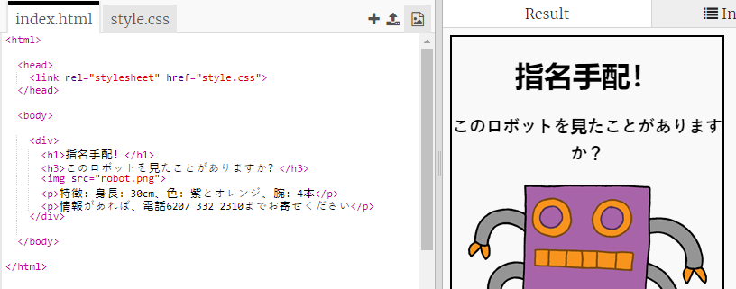
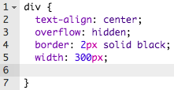
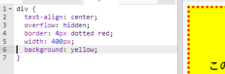

## ポスターのスタイリング

ポスターのCSSコードを編集することから始めましょう。

+ Trinketをひらく: jumpto.cc/web-wanted.
    
    プロジェクトはこのようになります。
    
    

+ 「style.css」タブをクリックします。 ポスターのさまざまな部分を含むdivのCSSプロパティが既にあることに気づくでしょう。
    
        div {
            text-align: center;
            overflow: hidden;
            border: 2px solid black;
            width: 300px;
        }   
        

+ text-align プロパティを変更することから始めましょう：
    
        text-align: center;
        
    
    単語 centerを、left左へまたはright右へ変更するとどうなりますか？ 

+ ボーダープロパティはどうですか？
    
        border: 2px solid black;
        
    
    上記コードの`2px`は2ピクセルを意味します。`2pxの黒実線`を`4px赤点線`に変更するとどうなりますか？

+ ポスターのwidth幅を400pxへ変更します 。ポスターはどうなりますか？

+ ポスターの background背景色を設定するCSSを追加しましょう。コードの5行目の最後に移動し、returnキーを押すと、新しい空白行が作成されます。
    
    
    
    新しい空白行に次のコードを入力します。
    
        background: yellow;
        
    
    上記のようにコードを正確に 入力してください。背景が黄色になっていることに注意してください。
    
    