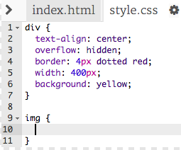
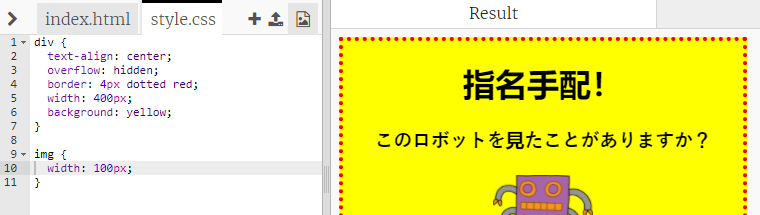

## 画像のスタイリング

ポスターの画像のスタイルを改善しましょう。

+ 現時点では、タグのCSSプロパティはありませんので、追加してみましょう！
    
    まず、divのCSSの下に次のコードを追加します。
    
        img {
        
        }
        
    
    

+ We can now add CSS properties for images between the curly brackets.
    
    たとえば、中括弧の間に次のコードを追加して、画像の幅を設定します。
    
        width: 100px;
        
    
    画像のサイズが変更され、幅が100ピクセルになることがわかります。
    
    

+ 次のコードで画像の周りに枠線を追加することもできます：
    
        border: 1px solid black;
        

+ 画像と境界線の間にスペースがあまりないことに気づきましたか？
    
    
    
    これを修正するには、画像の周囲にパディングを追加します。
    
        padding: 10px;
        
    
    パディングとは、コンテンツ（この場合は画像）とその境界線の間のスペースです。
    
    
    
    paddingパディングを 50pxに変更した場合、どうなると思いますか？