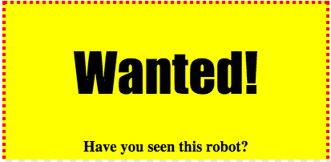

## スタイル見出し

`<h1>` 見出しのスタイルを改善しましょう。

+ イメージのCSSの下に次のコードを追加します。
    
        h1 {
        
        }
        
    
    ここでは、メイン `<h1>` 見出しのCSSプロパティを追加します。

+ `<h1>` 見出しのフォントを変更するには、中括弧の間に次のコードを追加します。
    
        font-family：インパクト。
        

+ 見出しのサイズを変更することもできます。
    
        font-size：50pt;
        

+ `<h1>` 見出しとその周りのものの間に大きなスペースがあることに気付きましたか？
    
    
    
    これは見出しの周りに余白があるためです。マージンとは、要素（この場合は見出し）とその周りの他の要素との間のスペースです。
    
    このコードでマージンを小さくすることができます：
    
        マージン：10ピクセル。
        
    
    

+ また、見出しに下線を付けることもできます：
    
        テキスト装飾：下線;