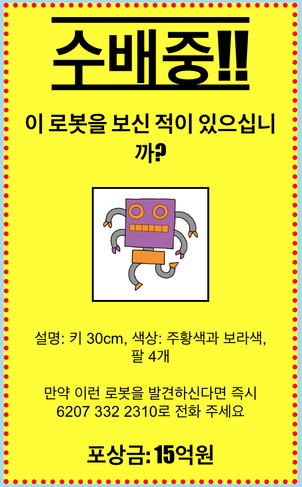

## 소개

이 프로젝트에서는 여러분이 직접 현상수배 포스터를 만드는 방법을 배우게 됩니다.

### 교육자들을 위한 추가 정보

이 프로젝트를 인쇄하려면 [프린트용 문서](https://projects.raspberrypi.org/en/projects/wanted/print)를 사용하십시오.

## \--- collapse \---

## title: 교육자 노트

## 소개

이 프로젝트에서 학생들은 자신이 제작한 CSS를 쓸 기회를 가지게 됩니다. 그리고 CSS 속성 및 선택을 편집하고 작성하여 자체 포스터를 만듭니다.

## 온라인 자료들

이 자료에서는 HTML과 CSS를 온라인으로 작성 가능한 [trinket](https://trinket.io/)을 사용하는 것을 권장합니다. 이 프로젝트는 아래와 같은 Trinket을 사용합니다:

* ['현상수배 포스터 만들기' 프로젝트 파일 -- jumpto.cc/web-wanted](http://jumpto.cc/web-wanted)

학생들은 새로운 Trinket[(jumpto.cc/html-black)](http://jumpto.cc/html-blank)을 사용할 수 있으며, 이를 통해 자신만의 HTML & CSS 코드를 작성하는 법을 배울 수 있습니다. 또한, 템플릿이 제공되어 있는 Trinket을 사용할 수 있습니다. [(jumpto.cc/html-template)](http://jumpto.cc/html-template).

프로젝트의 샘플 정답이 다음 Trinket에 있습니다.

* ['현상수배 포스터 만들기' 완성본 -- trinket.io/html/ebeb56398a](https://trinket.io/html/ebeb56398a)

## 오프라인 자료들

여러분의 선호에 따라 프로젝트를 [오프라인에서 완성](https://www.codeclubprojects.org/en-GB/resources/webdev-working-offline/)할 수 있습니다. 'Project Materials' 라는 링크를 클릭하여 이 프로젝트의 자료를 확인해볼 수 있습니다. 이 링크에는 학생들이 프로젝트를 오프라인으로 완료하는 데 필요한 자료가 포함된 'Project Resource' 섹션이 있습니다. 학생들이 이러한 자료의 사본에 접근할 수 있는지 확인하십시오. 이 섹션에는 아래와 같은 파일들이 포함되어 있습니다.

* template/index.html
* template/style.css
* wanted/index.html
* wanted/style.css
* wanted/robot.png

이 프로젝트의 완성된 버전은 'Volunteer Resources' 섹션에서 찾을 수 있습니다. 다음 파일이 있습니다:

* wanted-finished/index.html
* wanted-finished/style.css
* wanted-finished/robot.png

(또한 위의 모든 자료는 프로젝트 및 자원봉사자 `.zip` 파일로 다운로드 할 수 있습니다.)

## 학습 목표

* 이 프로젝트에서는 직접 제작한 CSS를 사용하여 웹 페이지를 꾸며 볼 기회를 가지게 됩니다.

이 프로젝트는 [라즈베리파이 디지털 메이킹 커리큘럼](http://rpf.io/curriculum) 중 아래의 과정에 있는 요소들을 다룹니다.

* [2D와 3D 디자인](https://www.raspberrypi.org/curriculum/design/creator)

## 도전과제

* "포스터 개선" - `div`에 새로운 CSS 속성을 추가
* "이미지 개선" - `img`에 새로운 CSS 속성을 추가
* "포스터를 멋있게 만들기" - `p`와 `h3`에 새로운 CSS 속성을 추가
* "이벤트 광고하기" - HTML과 CSS 코드 작성 및 수정

\--- /collapse \---

## \--- collapse \---

## title: 프로젝트 자료

## 프로젝트 리소스

* [프로젝트의 모든 리소스가 들어있는 .zip 파일](resources/wanted-project-resources.zip)
* [현상수배 포스터 만들기 프로젝트 자료가 포함된 온라인 Trinket](http://jumpto.cc/web-wanted)
* [온라인 Trinket 템플릿](http://jumpto.cc/trinket-template)
* [빈 Trinket](http://jumpto.cc/trinket-blank)
* [template/index.html](resources/template-index.html)
* [template/style.css](resources/template-style.css)
* [wanted/index.html](resources/wanted-index.html)
* [wanted/style.css](resources/wanted-style.css)
* [wanted/robot.png](resources/wanted-robot.png)

## 교육자를 위한 자료

* [완성된 모든 프로젝트 리소스가 들어있는 .zip 파일](resources/wanted-volunteer-resources.zip)
* [완성된 온라인 Trinket 프로젝트](https://trinket.io/html/ebeb56398a)
* [wanted-finished/index.html](resources/wanted-finished-index.html)
* [wanted-finished/style.css](resources/wanted-finished-style.css)
* [twanted-finished/robot.png](resources/twanted-finished-robot.png)

\--- /collapse \---