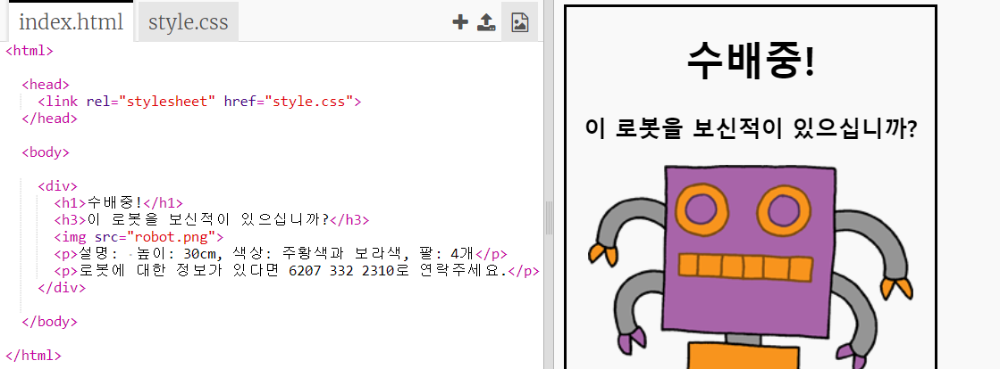
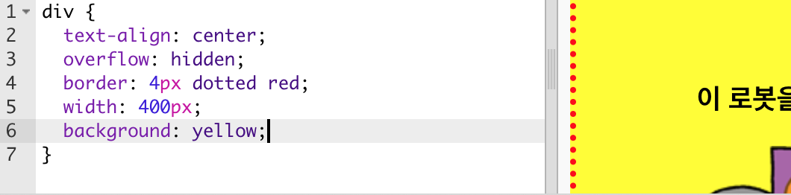

## 현상수배 포스터 스타일링하기

현상수배 포스터에 대한 CSS 코드를 편집해 봅시다.

+ 다음 Trinket 파일을 열어주세요. <a target="_blank" href="http://jumpto.cc/web-wanted">jumpto.cc/web-wanted</a>.
    
    프로젝트는 아래와 같이 보일 것입니다:
    
    

+ "style.css" 탭을 클릭하세요. `div`에 대한 속성이 아래와 같이 이미 있음을 알 수 있습니다.
    
        div {
            text-align: center;
            overflow: hidden;
            border: 2px solid black;
            width: 300px;
        }   
        

+ 이제 `text-align` 속성부터 한번 바꿔 보기로 하겠습니다.
    
        text-align: center;
        
    
    만약 `center`를 `left`나 `right`로 바꾸면 어떤 일이 일어날까요?

+ `border` 속성은 어떤 역할을 할까요?
    
        border: 2px solid black;
        
    
    코드에 있는 `2px`는 2 픽셀을 의미합니다. `2px solid black` 코드를 `4px dotted red`로 바꾸면 무슨 일이 일어날까요?

+ `width`를 `400px`로 바꿔 봅시다. 포스터에 무슨 일이 일어날까요?

+ 포스터의 배경 색을 설정하기 위해 CSS를 추가해 봅시다. 코드의 5번째 줄 끝으로 이동하여 Enter를 누르면 새 빈 행이 생깁니다.
    
    
    
    여기에 아래 코드를 입력하세요.
    
        background: yellow;
        
    
    Make sure that you type in the code *exactly* as it is above. You should notice that the background of the `
` is now yellow.
    
    