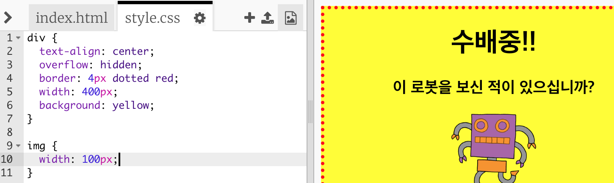

## 이미지 스타일링하기

포스터의 이미지를 개선시켜 봅시다.

+ 현재 `` 태그에는 CSS 속성이 없으므로 몇가지 추가해 봅시다.
    
    첫째, div에 대한 CSS 아래 다음 코드를 추가하세요.
    
        img {
        
        }
        
    
    

+ 이제 이미지의 CSS 속성을 중괄호 사이에 추가할 수 있습니다.
    
    예를 들어, 이미지의 너비를 설정하려면 {} 사이에 이 코드를 추가하십시오.
    
        width: 100px;
        
    
    폭이 100 픽셀이 되도록 이미지의 크기가 변하는 것을 볼 수 있습니다.
    
    

+ 이 코드를 추가하여 이미지에 테두리를 추가할 수 있습니다. 
    
        border: 1px solid black;
        

+ 이미지와 테두리 사이에 공간이 없다는 것을 알아채셨습니까?
    
    
    
    이미지 주위에 여백을 추가하여 문제를 해결할 수 있습니다. 
    
        padding: 10px;
        
    
    padding은 내용(이 경우에는 이미지) 과 경계 사이의 공간을 의미합니다.
    
    
    
    padding을 `50px`로 변경하면 어떻게 변할까요?