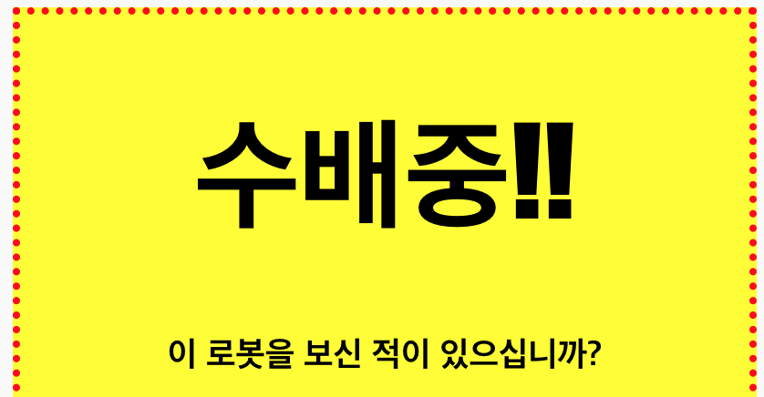
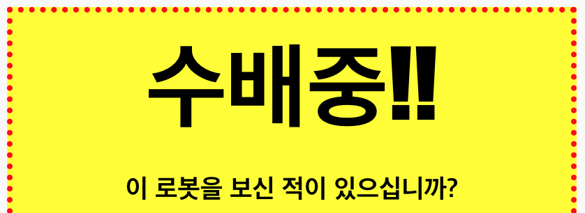

## 제목 스타일링하기

`<h1>` 의 스타일을 개선시켜 보도록 하겠습니다.

+ 이미지의 CSS 아래에 다음 코드를 추가합니다.
    
        h1 {
        
        }
        
    
    이 코드에 `<h1>`에 대한 CSS 속성을 추가합니다.

+ `<h1>`의 폰트를 바꾸고 싶은 경우, 중괄호 사이에 다음 코드를 추가하세요.
    
        font-family: Impact;
        

+ 제목의 크기도 변경할 수 있습니다.
    
        font-size: 50pt;
        

+ 제목(`<h1>`)과 테두리 사이에 여백이 너무 큽니다.
    
    
    
    왜냐하면 제목 주위에 마진(margin)이 있기 때문인데, 마진은 각 요소와 다른 요소 사이의 여백을 의미합니다.
    
    이 코드를 추가하여 여백을 더 작게 만들 수 있습니다.
    
        margin: 10px;
        
    
    

+ 아래와 같이 제목에 밑줄을 그을 수도 있습니다:
    
        text-decoration: underline;