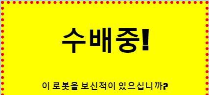
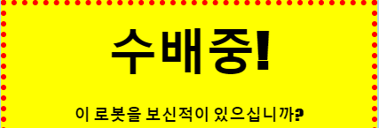

## 제목 스타일링하기

`<h1>` 의 스타일을 개선시켜 보도록 하겠습니다.

+ 이미지의 CSS 아래에 다음 코드를 추가합니다.
    
        h1 {
        
        }
        
    
    여기서 메인 `<h1>` 제목에 CSS 속성을 추가할 수 있다.

+ `<h1>`의 글꼴를 바꾸고 싶은 경우, 중괄호 사이에 다음 코드를 추가하세요.
    
        font-family: Impact;
        

+ 제목의 크기도 변경할 수 있습니다.
    
        font-size: 50pt;
        

+ 제목(`<h1>`)과 테두리 사이에 여백이 크다는 것을 알아 챘습니까?
    
    
    
    제목 주위에 여백(margin)이 있기 때문인데, 여백은 요소(이 경우 제목)와 주변의 다른 요소 사이의 여백을 의미합니다.
    
    이 코드를 추가하여 여백을 더 작게 만들 수 있습니다.
    
        margin: 10px;
        
    
    

+ 아래와 같이 제목에 밑줄을 그을 수도 있습니다:
    
        text-decoration: underline;