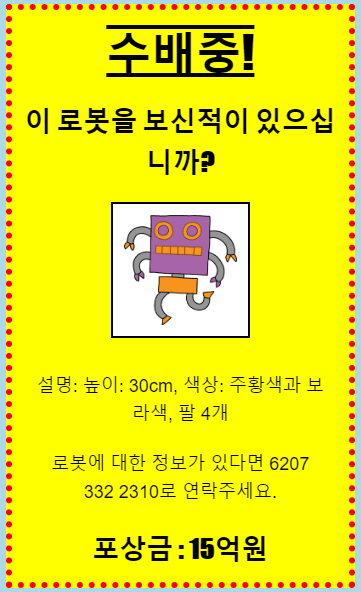

\--- challenge \---

## 과제: 자신만의 멋진 포스터 만들기!

`<h3>`로 구성된 제목과 단락의 스타일을 설정하기위해 CSS 코드를 추가하십시오.

다음은 사용할 수 있는 CSS 속성 목록입니다.

    color: black;
    background: white;
    font-family: Arial / Comic Sans MS / Courier / Impact / Tahoma;
    font-size: 12pt;
    font-weight: bold;
    text-decoration: underline overline line-through;
    margin: 10px;
    padding: 10px;
    width: 100px;
    height: 100px;
    

\--- /challenge \---