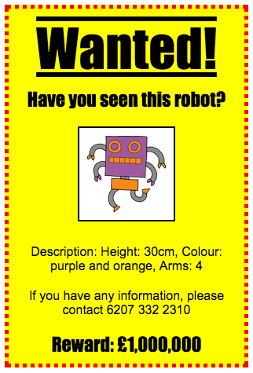

## Uvod

U ovom projektu naučićeš kako da napraviš sopstveni plakat.

### Dodatne informacije za vođe kluba

Ukoliko je potrebno da odštampate ovaj projekat, koristite [Verziju za štampu](https://projects.raspberrypi.org/me-ME/projects/wanted/print).

--- collapse ---
---
title: Bilješke za vođe kluba
---
## Uvod:

U ovom projektu djeca će imati priliku da napišu sopstveni CSS. Takođe će uređivati i pisati CSS svojstva i selektore, kako bi napravila sopstveni plakat.

## Online izvori

Za pisanje HTML-a i CSS-a online preporučujemo da koristite [trinket](https://trinket.io/). Ovaj projekat sadrži sljedeće trinkete:

* [Početak projekta 'Tražen' -- trinket.io/html/0d8897c8f7](http://trinket.io/html/0d8897c8f7)

Za pisanje sopstvenog HTML-a i CSS-a, djeca takođe mogu da koriste ovaj prazan trinket [(jumpto.cc/html-blank)](http://jumpto.cc/html-blank) ili da koriste ovaj trinket šablon [(jumpto.cc/html-template)](http://jumpto.cc/html-template).

Takođe postoji trinket koji sadrži primjer rješenja izazova:

* [Završen projekat 'Tražen' -- trinket.io/html/245ddecdb3](https://trinket.io/html/245ddecdb3)

## Offline izvori

Ako želite, ovaj projekat može biti [izrađen offline](https://www.codeclubprojects.org/en-GB/resources/webdev-working-offline/). Izvorima projekta možete pristupiti klikom na link projekta 'Projektni materijali'. Navedeni link sadrži odjeljak 'Izvori projekta' u kojem se nalaze izvori koji će djeci biti potrebni kako bi izradila ovaj projekat offline. Obezbijedite da svako dijete ima pristup kopiji ovih izvora. Odjeljak sadrži sljedeće datoteke:

* template/index.html
* template/style.css
* wanted/index.html
* wanted/style.css
* wanted/robot.png

Takođe, završenu verziju izazova ovoga projekta možete naći u odjeljku 'Izvori za volontere' koji sadrži:

* wanted-finished/index.html
* wanted-finished/style.css
* wanted-finished/robot.png

(Sve navedene izvore moguće je preuzeti kao `.zip` datoteke.)

## Ciljevi učenja

* U ovom projektu djeci se pruža mogućnost da napišu sopstveni CSS za stilizovanje veb-stranice.

Ovim projektom obuhvaćeni su elementi iz sljedećih dijelova [Raspberry Pi Digital Making Curriculum](http://rpf.io/curriculum):

* [Dizajniranje osnovnih 2D i 3D elemenata](https://www.raspberrypi.org/curriculum/design/creator).

## Izazovi

* ''Poboljšaj svoj plakat'' - dodavanje novih CSS svojstava selektoru `div`;
* ''Poboljšaj svoju sliku'' - dodavanje novih CSS svojstava selektoru `img`;
* ''Napravi fenomenalan plakat'' - dodavanje novih CSS svojstava i novih selektora `h3` i `p`;
* ''Reklamiraj događaj'' - pisanje i uređivanje HTML i CSS kôdova.

--- /collapse ---

--- collapse ---
---
title: Projektni materijali
---
## Izvori projekta

* [.zip datoteka koja sadrži sve izvore projekta](resources/wanted-project-resources.zip)
* [Online Trinket koji sadrži sve izvore projekta 'Tražen!'](https://trinket.io/html/0d8897c8f7)
* [Online Trinket šablon](http://jumpto.cc/trinket-template)
* [Online prazan Trinket](http://jumpto.cc/trinket-blank)
* [template/index.html](resources/template-index.html)
* [template/style.css](resources/template-style.css)
* [wanted/index.html](resources/wanted-index.html)
* [wanted/style.css](resources/wanted-style.css)
* [wanted/robot.png](resources/wanted-robot.png)

## Izvori za vođe kluba

* [.zip datoteka koja sadrži sve završene izvore projekta](resources/wanted-volunteer-resources.zip)
* [Završen Trinket projekat online](https://trinket.io/html/245ddecdb3)
* [wanted-finished/index.html](resources/wanted-finished-index.html)
* [wanted-finished/style.css](resources/wanted-finished-style.css)
* [twanted-finished/robot.png](resources/twanted-finished-robot.png)

--- /collapse ---