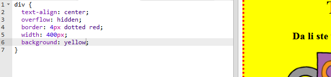

## Stilizovanje plakata

Počnimo uređivanjem CSS kôda za plakat.

+ Otvori sljedeći trinket: <a target="_blank" href="http://jumpto.cc/web-wanted">jumpto.cc/web-wanted</a>.
    
    Projekat treba da izgleda ovako:
    
    

+ Klikni na karticu "style.css". Primijetićeš da već postoje neka CSS svojstva za `div` koji sadrži različite dijelove plakata.
    
        div {
            text-align: center;
            overflow: hidden;
            border: 2px solid black;
            width: 300px;
        }   
        

+ Počnimo tako što ćemo promijeniti svojstvo `text-align` (poravnanje teksta):
    
        text-align: center;
        
    
    Šta se dešava kada promijeniš riječ `center` (centar) u `left` (lijevo) ili `right` (desno)?

+ Pogledajmo sada svojstvo `border` (okvir).
    
        border: 2px solid black;
        
    
    `2px` u gornjem kôdu označava 2 piksela. Šta će se desiti kada promijeniš `2px solid black` (2px puna crna) u `4px dotted red` (4 px tačkasta crvena)?

+ Sada promijeni svojstvo `width` (širina) postera u `400px`. Šta se dogodilo sa plakatom?

+ Dodajmo malo CSS-a da odredimo boju pozadine postera. Idi na kraj 5. reda svog kôda i pritisni taster return da dobiješ novi prazan red.
    
    
    
    U novom praznom redu upiši sljedeći kôd:
    
        background: yellow;
        
    
    Provjeri da li je upisani kôd *jednak* kôdu datom iznad. Primijetićeš da je pozadina elementa `
` sada žuta.
    
    