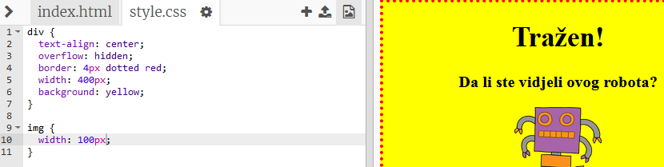

## Stilizovanje slika

Poboljšajmo stil slike u plakatu.

+ Trenutno nema nijednog CSS svojstva za oznaku ``. Dodajmo neke!
    
    Za početak, dodajmo sljedeći kôd ispod CSS-a za tvoj div:
    
        img {
        
        }
        
    
    

+ Sada možemo da dodamo CSS svojstva za slike između vitičastih zagrada { }.
    
    Na primjer, između vitičastih zagrada dodaj sljedeći kôd da odrediš širinu slike:
    
        width: 100px;
        
    
    Vidjećeš da se veličina slike promijenila. Sada je njena širina 100 piksela.
    
    

+ Takođe možeš da dodaš okvir oko slike koristeći sljedeći kôd:
    
        border: 1px solid black;
        

+ Da li primjećuješ da nema puno mjesta između slike i okvira?
    
    
    
    Ovo možeš da popraviš dodajući 'padding' oko slike:
    
        padding: 10px;
        
    
    'Padding' je prostor između sadržaja (u ovom slučaju slike) i njegovog okvira.
    
    
    
    Šta misliš da će se dogoditi ako promijeniš 'padding' na `50px`?