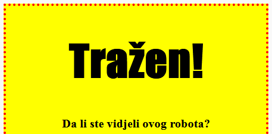
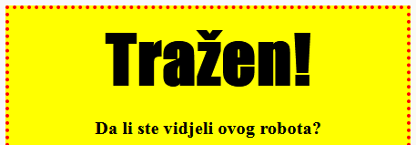

## Stilizovanje naslova

Poboljšajmo sada stil `<h1>` naslova.

+ Dodaj sljedeći kôd ispod CSS-a slike:
    
        h1 {
        
        }
        
    
    Tu ćeš dodati CSS svojstva za glavni naslov `<h1>`.

+ Za promjenu fonta `<h1>` naslova, između vitičastih zagrada dodaj sljedeći kôd:
    
        font-family: Impact;
        

+ Takođe možeš promijeniti veličinu naslova:
    
        font-size: 50pt;
        

+ Primjećuješ li da postoji veliki prostor između `<h1>` naslova i elemenata oko njega?
    
    
    
    To se dešava zbog toga što oko naslova postoji margina. Margina je razmak između elementa (u ovom slučaju naslova) i ostalih stvari oko njega.
    
    Marginu možeš da smanjiš sljedećim kôdom:
    
        margin: 10px;
        
    
    

+ Svoj naslov možeš i da podvučeš:
    
        text-decoration: underline;