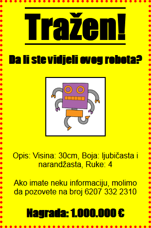

\--- challenge \---

## Izazov: Napravi fenomenalan plakat!

Dodaj još CSS kôda da stilizuješ svoje `<h3>` naslove i pasuse.

Ovo je lista nekih CSS svojstava koje možeš koristiti:

    color: black;
    background: white;
    font-family: Arial / Comic Sans MS / Courier / Impact / Tahoma;
    font-size: 12pt;
    font-weight: bold;
    text-decoration: underline overline line-through;
    margin: 10px;
    padding: 10px;
    width: 100px;
    height: 100px;
    

\--- /challenge \---