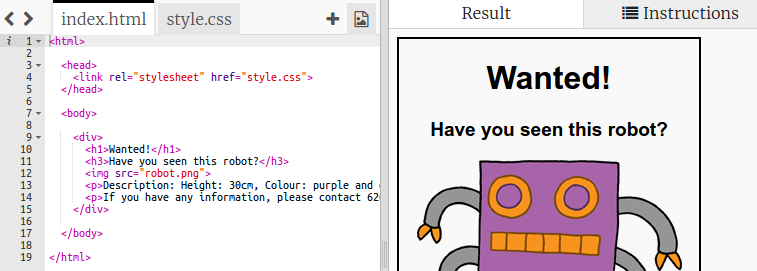

## आपले पोस्टर सजवा

पोस्टरसाठी सीएसएस कोड संपादित करुन सुरवात करूया.

+ हे ट्रिंकेट उघडा: <a target="_blank" href="http://jumpto.cc/web-wanted">jumpto.cc/web-wanted</a>.
    
    प्रकल्प असा दिसायला हवा:
    
    

+ "style.css" टॅबवर क्लिक करा. आपल्या लक्षात येईल की आधीपासूनच पोस्टरचे वेगवेगळे `div` भागांसाठी सीएसएस गुणधर्म लिहिलेले आहेत.
    
        div {
            text-align: center;
            overflow: hidden;
            border: 2px solid black;
            width: 300px;
        }   
        

+ `text-align` प्राॅपर्टी बदलून प्रारंभ करूया:
    
        text-align: center;
        
    
    आपण `center` शब्द जेव्हा `left` किंवा `right` मध्ये बदलता तेव्हा काय होते?

+ `border` प्राॅपर्टी बद्दल काय?
    
        border: 2px solid black;
        
    
    `2px` म्हणजे वरील कोड मध्ये 2 पिक्सेल आहे. आपण `2px solid black` ला `4px dotted red` याचात बदलल्यास काय होते?

+ पोस्टरच्या `width` ला `400px` करा. पोस्टरमध्ये काय बदल होतो?

+ पोस्टरचा बॅकग्राउंड रंग सेट करण्यासाठी थोडे सीएसएस जोडू. आपल्या कोडच्या 5 व्या ओळीच्या शेवटी जा आणि रिटर्न दाबा, जेणेकरून आपल्याकडे नवीन रिकामी ओळ असेल.
    
    
    
    आपल्या नवीन रिकाम्या ओळीवर खालील कोड टाइप करा:
    
        background: yellow;
        
    
    आपण वरचा कोड *अचूक* टाइप केला आहे ह्याची खात्री करा. आपण हे लक्षात घ्यावे की `
` चा बॅकग्राउंड रंग आता पिवळा झाला आहे.
    
    