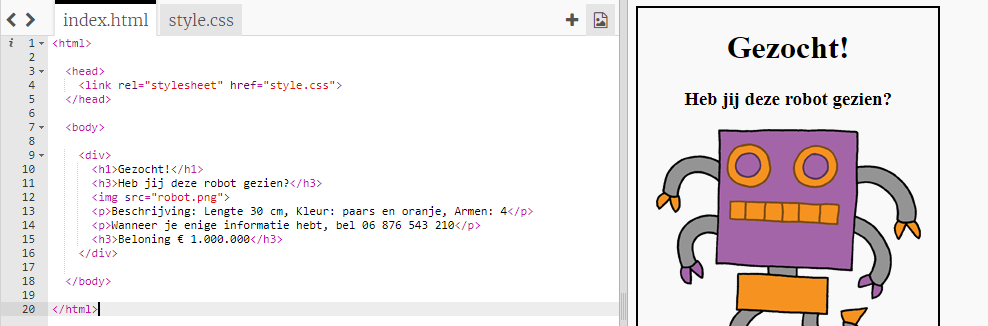
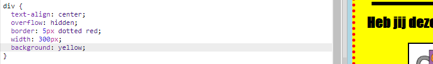

## Uw poster stylen

Laten we beginnen met het bewerken van de CSS-code voor de poster.

+ Open deze trinket: <a target="_blank" href="http://jumpto.cc/web-wanted">jumpto.cc/web-wanted</a>.
    
    Het project zou er als volgt uit moeten zien:
    
    

+ Klik op het tabblad "style.css". U zult merken dat er al CSS-eigenschappen zijn voor de `div` die de verschillende delen van de poster bevatten.
    
        div {text-align: center; overloop verborgen; rand: 2px effen zwart; breedte: 300 px; }   
        

+ Laten we beginnen met het wijzigen van de eigenschap `text-align`:
    
        text-align: center;
        
    
    Wat gebeurt er wanneer je het woord `midden` tot `links` of `rechts` wijzigt?

+ Wat dacht je van de `border` property?
    
        rand: 2px effen zwart;
        
    
    `2px` in de bovenstaande code betekent 2 pixels. Wat gebeurt er wanneer je `2px effen zwart` in `4px gestippeld rood` verandert?

+ Wijzig de `width` van de poster in `400 px`. Wat gebeurt er met de poster?

+ Laten we wat CSS toevoegen om de achtergrondkleur van de poster in te stellen. Ga naar het einde van regel 5 van je code en druk op Return, zodat je een nieuwe lege regel hebt.
    
    
    
    Typ de volgende code op uw nieuwe lege regel:
    
        achtergrond: geel;
        
    
    Zorg ervoor dat u de code *precies* typt, aangezien deze hierboven staat. Je zou moeten opmerken dat de achtergrond van de `
` nu geel is.
    
    