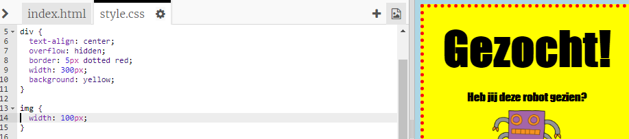

## Afbeeldingen opmaken

Laten we de opmaak van de afbeelding op de poster verbeteren.

+ Op dit moment zijn er geen CSS-eigenschappen voor je `` -tag, dus laten we er wat aan toevoegen!
    
    Voeg eerst de volgende code onder de CSS voor je div toe:
    
        img {
        
        }
        
    
    

+ We kunnen nu CSS-eigenschappen voor afbeeldingen toevoegen tussen de `` accolades.
    
    Voeg bijvoorbeeld deze code toe tussen de accolades om de breedte van de afbeelding in te stellen:
    
        width: 100px;
        
    
    Je zult zien dat de grootte van de afbeelding verandert, de breedte is nu 100 pixels.
    
    

+ Je kunt ook een rand rond de afbeelding toevoegen met deze code:
    
        border: 1px solid black;
        

+ Is het je opgevallen dat er niet veel ruimte tussen het beeld en de rand is?
    
    
    
    Je kunt dit oplossen door wat opvulling rond de afbeelding toe te voegen:
    
        padding: 10px;
        
    
    Padding is de ruimte tussen de inhoud (in dit geval een afbeelding) en de rand ervan.
    
    
    
    Wat denk je dat er zou gebeuren als je de padding veranderde in `50px`?