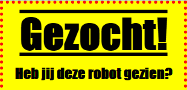
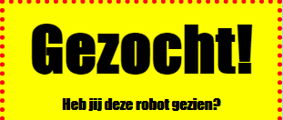

## Stylingskoppen

Laten we de stijl van de rubriek `<h1>` verbeteren.

+ Voeg de volgende code toe onder de CSS van uw afbeelding:
    
        h1 {}
        
    
    Dit is waar je CSS-eigenschappen voor je hoofd `<h1>` rubriek zult toevoegen.

+ Als u het lettertype van uw `<h1>` koppen wilt wijzigen, voegt u de volgende code toe tussen de accolades:
    
        font-family: Impact;
        

+ U kunt ook de grootte van de kop wijzigen:
    
        lettergrootte: 50pt;
        

+ Is het je opgevallen dat er een grote ruimte is tussen de `<h1>` kop en de dingen eromheen?
    
    
    
    Dit komt omdat er een marge rond de kop is. Een marge is de ruimte tussen het element (in dit geval een kop) en de andere spullen eromheen.
    
    U kunt de marge kleiner maken met deze code:
    
        marge: 10px;
        
    
    

+ U kunt ook uw kop onderstrepen:
    
        tekstdecoratie: onderstrepen;