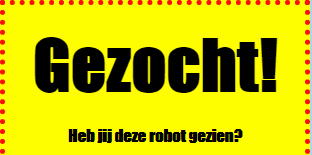

## Koppen opmaken

Laten we de stijl van de kop `<h1>` verbeteren.

+ Voeg de volgende code toe onder de CSS van je afbeelding:
    
        h1 {
        
        }
        
    
    Dit is waar je CSS-eigenschappen voor je hoofd `<h1>` rubriek zult toevoegen.

+ Als je het lettertype van je `<h1>` koppen wilt wijzigen, voeg je de volgende code toe tussen de accolades:
    
        font-family: Impact;
        

+ Je kunt ook de grootte van de kop wijzigen:
    
        font-size: 50pt;
        

+ Is het je opgevallen dat er een grote ruimte bestaat tussen de `<h1>` kop en de dingen eromheen?
    
    
    
    Dit komt omdat er een marge rond de kop is. Een marge is de ruimte tussen het element (in dit geval een kop) en het andere eromheen.
    
    Je kunt de marge kleiner maken met deze code:
    
        margin: 10px;
        
    
    

+ Je kunt ook je kop onderstrepen:
    
        text-decoration: underline;