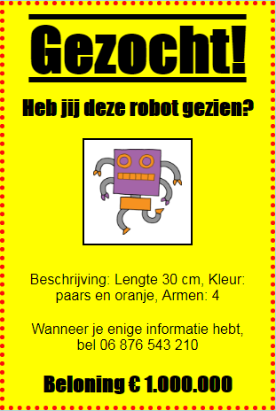

--- challenge ---

## Uitdaging: maak je poster geweldig!

Voeg meer CSS-code toe om je `<h3>` koppen en de alinea's op te maken.

Hier is een lijst met enkele CSS-eigenschappen die je kunt gebruiken:

    color: black;
    background: white;
    font-family: Arial / Comic Sans MS / Courier / Impact / Tahoma;
    font-size: 12pt;
    font-weight: bold;
    text-decoration: underline overline line-through;
    margin: 10px;
    padding: 10px;
    width: 100px;
    height: 100px;
    

--- /challenge ---