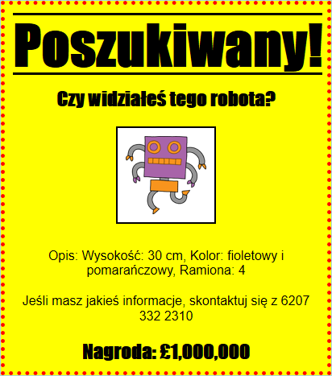

## Wstęp

W tym projekcie dowiesz się, jak zrobić swój własny plakat.

### Dodatkowe informacje dla liderów klubów

Jeśli chcesz wydrukować ten projekt, użyj [wersji do druku](https://projects.raspberrypi.org/en/projects/wanted/print).

## \--- collapse \---

## title: Notatki dla liderów klubów

## Wstęp:

W tym projekcie dzieci będą miały możliwość napisania własnego CSS. Będą również edytować i pisać właściwości i selektory CSS, aby stworzyć własny plakat.

## Zasoby online

Do pisania kodu HTML i CSS online zalecamy użytkowanie edytora [trinket](https://trinket.io/). Ten projekt zawiera następujące szablony:

* [Punkt początkowy projektu "Poszukiwany" - jumpto.cc/web-wanted](http://jumpto.cc/web-wanted)

Dzieci mogą też używać pustego edytora [(jumpto.cc/html-blank)](http://jumpto.cc/html-blank) do pisania swojego kodu HTML i CSS lub skorzystać z tego szablonu [(jumpto.cc/html-template)](http://jumpto.cc/html-template).

Dostępny jest także projekt zawierający przykładowe rozwiązania wyzwań:

* [Ukończony projekt 'Poszukiwany' -- trinket.io/html/ebeb56398a](https://trinket.io/html/ebeb56398a)

## Zasoby offline

Ten projekt może być [ ukończony w trybie offline ](https://www.codeclubprojects.org/en-GB/resources/webdev-working-offline/). Materiały potrzebne do wykonania projektu dostępne są po kliknięciu linku "Materiały do projektu". Ten link zawiera sekcję "Zasoby projektu", która zawiera zasoby, których dzieci będą potrzebować, aby ukończyć ten projekt w trybie offline. Upewnij się, że każde dziecko ma dostęp do tych zasobów. Ta sekcja zawiera następujące pliki:

* template/index.html
* template/style.css
* wanted/index.html
* wanted/style.css
* wanted/robot.png

Ukończoną wersję zadań z tego projektu można również znaleźć w sekcji "Zasoby dla wolontariuszy", która zawiera:

* wanted-finished/index.html
* wanted-finished/style.css
* wanted-finished/robot.png

(Wszystkie powyższe zasoby można również pobrać jako pliki `.zip`.)

## Cele dydaktyczne

* Ten projekt daje dzieciom możliwość napisania własnego kodu CSS aby stworzyć styl strony internetowej.

Projekt ten obejmuje elementy z następujących wątków [Cyfrowego programu nauczania Raspberry Pi](http://rpf.io/curriculum):

* [ Projektuj podstawowe zasoby 2D i 3D](https://www.raspberrypi.org/curriculum/design/creator).

## Wyzwania

* "Ulepszanie Twojego plakatu" - dodawanie nowych właściwości CSS do selektora `div`;
* "Ulepszanie Twojego obrazu" - dodawanie nowych właściwości CSS do selektora `img`;
* "Spraw, by Twój plakat był niesamowity" - dodawanie nowych właściwości CSS i nowych selektorów ` h3 ` i ` str `;
* "Zareklamuj wydarzenie" - Pisanie i edytowanie kodu HTML i CSS.

\--- /collapse \---

## \--- collapse \---

## title: Materiały do projektu

## Zasoby projektu

* [Plik .zip zawierający wszystkie zasoby potrzebne do wykonania projektu](resources/wanted-project-resources.zip)
* [Trinket zawierający wszystkie zasoby potrzebne do realizacji projektu "Poszukiwany!"](http://jumpto.cc/web-wanted)
* [Pusty szablon Trinket](http://jumpto.cc/trinket-template)
* [Pusty Trinket](http://jumpto.cc/trinket-blank)
* [template/index.html](resources/template-index.html)
* [template/style.css](resources/template-style.css)
* [wanted/index.html](resources/wanted-index.html)
* [wanted/style.css](resources/wanted-style.css)
* [wanted/robot.png](resources/wanted-robot.png)

## Zasoby dla lidera klubu

* [Plik .zip zawierający zasoby z ukończonym projektem](resources/wanted-volunteer-resources.zip)
* [Trinket zawierający ukończony projekt](https://trinket.io/html/ebeb56398a)
* [wanted-finished/index.html](resources/wanted-finished-index.html)
* [wanted-finished/style.css](resources/wanted-finished-style.css)
* [wanted-finished/robot.png](resources/twanted-finished-robot.png)

\--- /collapse \---