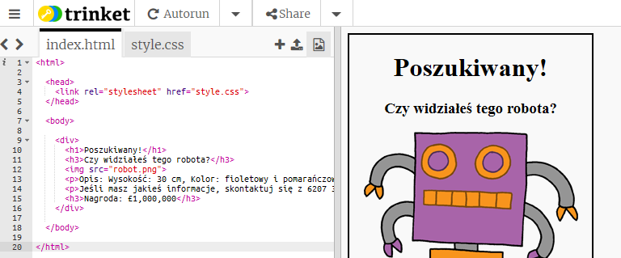

## Stylizowanie swojego plakatu

Zacznijmy od edycji kodu CSS dla plakatu.

+ Otwórz edytor: <a target="_blank" href="https://trinket.io/html/31974627d3">https://trinket.io/html/31974627d3</a>.
    
    Projekt powinien wyglądać następująco:
    
    

+ Kliknij kartę "style.css". Zauważysz, że istnieją już właściwości CSS dla elementu `div` zawierające różne części plakatu.
  ```  
        div {
            text-align: center;
            overflow: hidden;
            border: 2px solid black;
            width: 300px;
        }   
  ```      

+ Zacznijmy od zmiany właściwości `text-align`:
  ```  
        text-align: center;
  ```      
    
    Co się stanie, gdy zmienisz słowo `center` na `left` lub `right`?

+ A co z właściwością `border`?
  ```  
        border: 2px solid black;
  ```      
    
    `2 px` w powyższym kodzie oznacza 2 piksele. Co się stanie, gdy zmienisz `2px solid black` na `4 px dotted red`?

+ Zmień właściwość `width` plakatu na `400px`. Co dzieje się z plakatem?

+ Dodajmy trochę CSS, aby ustawić kolor tła plakatu. Przejdź na koniec linii 5 kodu i naciśnij klawisz Enter, aby otrzymać nową pustą linię.
    
    
    
    Wpisz następujący kod w nowej pustej linii:
    ```
        background: yellow;
    ```    
    
    Upewnij się, że wpisujesz kod *dokładnie* tak, jak to jest powyżej. Powinieneś zauważyć, że tło `<div>` jest teraz żółte.
    
    