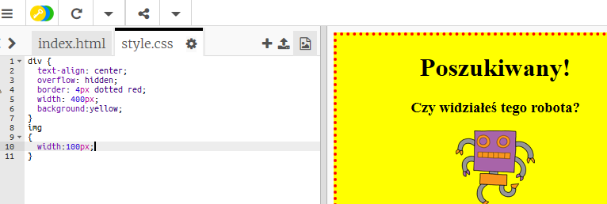

## Stylizacja obrazów

Poprawmy styl obrazu na plakacie.

+ W tej chwili nie ma żadnych właściwości CSS dla twojego znacznika ``, więc dodajmy jakieś!
    
    Po pierwsze, dodaj następujący kod CSS dla swojego div:
    
        img {
        
        }
        
    
    

+ Możemy teraz dodać właściwości CSS dla obrazów pomiędzy nawiasami klamrowymi.
    
    Na przykład dodaj ten kod między nawiasami klamrowymi aby ustawić szerokość obrazu:
    
        width: 100px;
        
    
    Zobaczysz, że rozmiar obrazu zmienia się, tak aby jego szerokość wynosiła 100 pikseli.
    
    

+ Możesz również dodać obramowanie wokół obrazu za pomocą tego kodu:
    
        border: 1px solid black;
        

+ Czy zauważyłeś, że między obrazem a granicą nie ma zbyt wiele odstępu?
    
    
    
    Możesz to naprawić, dodając wypełnienie wokół obrazu:
    
        padding: 10px;
        
    
    Wypełnienie to przestrzeń między treścią (w tym przypadku obrazem) a jej obramowaniem.
    
    
    
    Jak myślisz, co by się stało, gdyby zmienić wypełnienie na `50 px`?