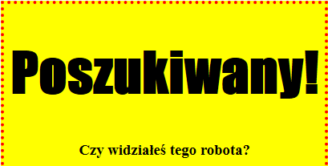
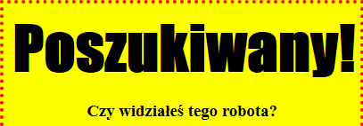

## Stylizacja nagłówków

Poprawmy styl nagłówka `<h1>`.

+ Dodaj następujący kod poniżej kodu CSS obrazu:
    
        h1 {
        
        }
        
    
    Tutaj dodajesz właściwości CSS do głównego nagłówka `<h1>`.

+ Aby zmienić czcionkę nagłówków `<h1>`, dodaj następujący kod wewnątrz nawiasów klamrowych:
    
        font-family: Impact;
        

+ Możesz również zmienić rozmiar nagłówka:
    
        font-size: 50pt;
        

+ Have you noticed that there's a big space between the `<h1>` heading and the stuff around it?
    
    
    
    This is because there's a margin around the heading. A margin is the space between the element (in this case a heading) and the other stuff around it.
    
    You can make the margin smaller with this code:
    
        margin: 10px;
        
    
    

+ You can also underline your heading:
    
        text-decoration: underline;