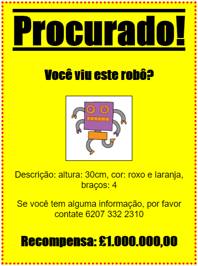

## Introdução

Neste projeto, você aprenderá como criar seu próprio pôster.

### Informação adicional para líderes de clubes

Se você precisar imprimir este projeto, use a [Versão para Impressão](https://projects.raspberrypi.org/en/projects/wanted/print).

## \--- collapse \---

## title: Notas do líder do clube

## Introdução:

Neste projeto, as crianças terão a oportunidade de escrever seu próprio CSS. Eles também editarão e escreverão propriedades e seletores CSS para criar seu próprio pôster.

## Recursos Online

Recomendamos usar o [trinket](https://trinket.io/) para escrever HTML & CSS online. Este projeto contém os seguintes trinkets:

* [Ponto de partida do 'Procurado' -- https://trinket.io/library/trinkets/e90a2a0254](https://trinket.io/html/e90a2a0254)

As crianças também podem usar este trinket em branco [(jumpto.cc/html-blank)](http://jumpto.cc/html-blank) para escrever seu próprio HTML & CSS, ou como alternativa, eles podem usar este modelo de trinket [(jumpto.cc/html-template)](http://jumpto.cc/html-template).

Há também um Trinket contendo um exemplo de solução para os desafios:

* ['Procurado' Concluído -- trinket.io/library/trinkets/d9e37a503e](https://trinket.io/html/d9e37a503e)

## Recursos Offline

Este projeto pode ser [concluído offline](https://www.codeclubprojects.org/en-GB/resources/webdev-working-offline/), se você preferir. Você pode acessar os recursos disponíveis clicando no link 'Materiais do Projeto'. Este link contém uma seção "Recursos do Projeto", que inclui recursos que as crianças precisarão para concluir esse projeto off-line. Certifique-se de que cada criança tenha acesso a uma cópia desses recursos. Esta seção inclui os seguintes arquivos:

* template/index.html
* template/style.css
* wanted/index.html
* wanted/style.css
* wanted/robot.png

You can also find a completed version of this project's challenges in the 'Club leader resources' section, which contains:

* wanted-finished/index.html
* wanted-finished/style.css
* wanted-finished/robot.png

(Todos os recursos acima também podem ser baixados como arquivos de projeto e de voluntário no formato `.zip`.)

## Objetivos de aprendizado

* Este projeto oferece às crianças a oportunidade de escrever seu próprio CSS para estilizar uma página Web.

Este projeto abrange elementos das seguintes vertentes do [Curriculo de Criação Digital Raspberry Pi](http://rpf.io/curriculum):

* [Design de ativos 2D e 3D básicos](https://www.raspberrypi.org/curriculum/design/creator).

## Desafios

* "Melhorando seu pôster" - adicionando novas propriedades CSS ao seletor `div`;
* "Melhorando sua imagem" - adicionando novas propriedades CSS ao seletor `img`;
* "Torne seu pôster incrível" - adicionando novas propriedades CSS e novos seletores `h3` e `p`;
* "Anuncie um evento" - Escrevendo e editando códigos HTML e CSS.

\--- /collapse \---

## \--- collapse \---

## title: Materiais do projeto

## Recursos do projeto

* [Arquivo .zip contendo todos os recursos do projeto](https://rpf.io/p/en/wanted-go)
* [Online Trinket contendo todos os recursos do projeto 'Procurado'](https://trinket.io/html/e90a2a0254)
* [Template Online Trinket](http://jumpto.cc/trinket-template)
* [Online Trinket em branco](http://jumpto.cc/trinket-blank)
* [template/index.html](resources/template-index.html)
* [template/style.css](resources/template-style.css)
* [wanted/index.html](resources/wanted-index.html)
* [wanted/style.css](resources/wanted-style.css)
* [wanted/robot.png](resources/wanted-robot.png)

## Recursos do líder do clube

* [arquivo.zip contendo todos os recursos do projeto concluídos](https://rpf.io/p/en/wanted-go)
* [Projeto Trinket online e completo](https://trinket.io/html/d9e37a503e)
* [wanted-finished/index.html](resources/wanted-finished-index.html)
* [wanted-finished/style.css](resources/wanted-finished-style.css)
* [twanted-finished/robot.png](resources/twanted-finished-robot.png)

\--- /collapse \---