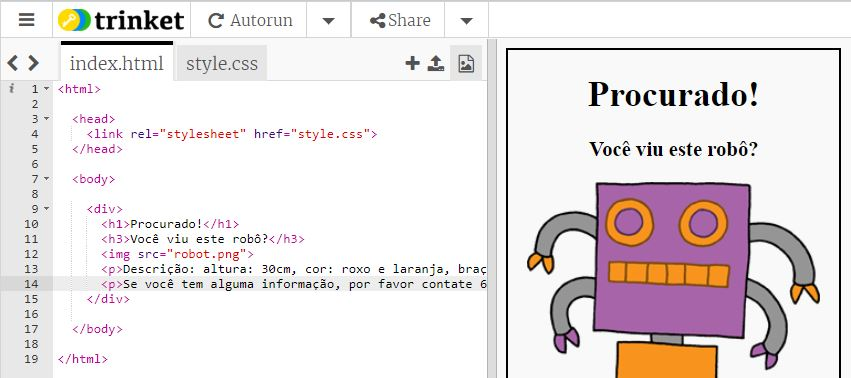
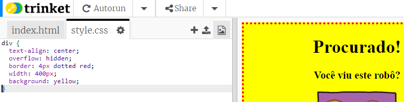

## Estilizando seu pôster

Vamos começar editando o código CSS do pôster.

+ Abra este trinket: <a target="_blank" href="https://trinket.io/html/109dfb8556">https://trinket.io/html/109dfb8556</a>.
    
    O projeto deve ficar assim:
    
    

+ Clique na aba "style.css". Você notará que já existem propriedades CSS para o `div` contendo as diferentes partes do cartaz.
    ```
        div {
            text-align: center;
            overflow: hidden;
            border: 2px solid black;
            width: 300px;
        }   
    ```   

+ Vamos começar alterando a propriedade `text-align`:
    ```
        text-align: center;
    ```    
    
    O que acontece quando você muda a palavra `center` (centralizar) para `left` (esquerda) ou `right` (direita)?

+ Que tal mudar a propriedade `border`?
    ```
        border: 2px solid black;
    ```    
    
    `2 px ` no código acima significa 2 pixels. O que acontece quando você altera o `2px solid black` para `4px dotted red`?

+ Altere a largura `width` do poster para `400 px`. O que acontece com o ele?

+ Vamos adicionar um código CSS para definir a cor de fundo do poster. Vá até o fim da linha 5 do código e pressione retorno, para que você tenha uma nova linha em branco.
    
    
    
    Digite o seguinte código em sua nova linha em branco:
    ```
        background: yellow;
    ```   
    
    Certifique-se de digitar o código *exatamente* como está acima. Você vai notar que o plano de fundo do `<div>` ficará amarelo.
    
    