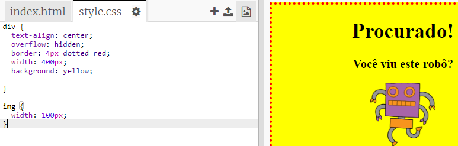

## Dando estilo a imagens

Vamos melhorar o estilo da imagem do poster.

+ No momento, não há propriedades CSS para sua tag ``, então vamos adicionar algumas!
    
    Em primeiro lugar, adicione o seguinte código abaixo ao CSS para sua div:
    
        img {
        
        }
        
    
    

+ Agora podemos adicionar propriedades CSS para imagens entre as "chaves".
    
    Por exemplo, adicione este código entre as chaves para definir a largura da imagem:
    
        width: 100px;
        
    
    Você verá que o tamanho da imagem muda, de modo que sua largura fique com 100 pixels.
    
    

+ Você também pode adicionar uma borda ao redor da imagem com este código:
    
        border: 1px solid black;
        

+ Você percebeu que não há muito espaço entre a imagem e a borda?
    
    
    
    Você pode corrigir isto adicionando um espaçamento ao redor da imagem:
    
        padding: 10px;
        
    
    Padding (preenchimento) é o espaço entre o conteúdo (neste caso, uma imagem) e sua borda.
    
    
    
    O que você acha que aconteceria se você alterasse o espaçamento para ` 50px `?