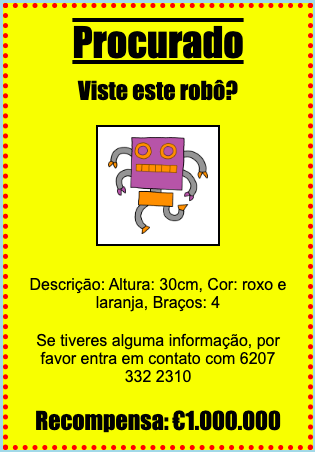

## Introdução

Neste projeto, vais aprender a criar o teu próprio cartaz.

### Informações adicionais para os líderes de clube

Se precisar imprimir este projeto, por favor, use a [versão para impressão](https://projects.raspberrypi.org/en/projects/wanted/print).

## \--- collapse \---

## title: Notas para os líderes de clube

## Introdução:

Neste projeto, as crianças vāo ter uma oportunidade de escrever o seu próprio CSS. Também irão editar e escrever propriedades e seletores CSS para criar o seu próprio cartaz.

## Recursos online

Recomendamos usar [trinket](https://trinket.io/) para escrever HTML & CSS online. Este projeto contém os seguintes trinkets:

* [Ínicio 'Procurado' - jumpto.cc/web-wanted](http://jumpto.cc/web-wanted)

As crianças podem também usar este trinket em branco [(jumpto.cc/html-blank)](http://jumpto.cc/html-blank) para escrever o seu próprio HTML & CSS, ou alternativamente podem usar este trinket de modelo [(jumpto.cc/html-template)](http://jumpto.cc/html-template).

Há também um trinket que contém uma amostra de solução para os desafios:

* ['Procurado' concluído - trinket.io/html/ebeb56398a](https://trinket.io/html/ebeb56398a)

## Recursos offline

Este projeto pode ser [ concluído offline ](https://www.codeclubprojects.org/en-GB/resources/webdev-working-offline/) se preferires. Pode aceder aos recursos do projeto clicando no link 'Materiais de Projeto' deste projeto. Este link contém uma seção 'Recursos do projeto', que inclui recursos que as crianças precisam para concluir este projeto offline. Certifique-se de que cada criança tem acesso a uma cópia destes recursos. Esta seção inclui os seguintes arquivos:

* template/index.html
* template/style.css
* wanted/index.html
* wanted/style.css
* wanted/robot.png

Também pode encontrar uma versão completa dos desafios deste projeto na seção 'Recursos Voluntários', que contém:

* wanted-finished/index.html
* wanted-finished/style.css
* wanted-finished/robot.png

(Todos os recursos acima também são transferíveis como arquivos `.zip` projeto e voluntário.)

## Objetivos de Aprendizagem

* Este projeto dá às crianças a oportunidade de escrever o seu próprio CSS para estilizar uma página web.

Este projeto abrange elementos das seguintes áreas do [ Curriculo Raspberry Pi Digital Making ](http://rpf.io/curriculum):

* [Design basic 2D and 3D assets](https://www.raspberrypi.org/curriculum/design/creator).

## Desafios

* "Melhorar o teu cartaz" - adicionando novas propriedades CSS ao seletor `div`;
* "Melhorar a tua imagem" - adicionando novas propriedades CSS ao seletor `img`;
* "Torna o teu cartaz incrível" - adicionando novas propriedades CSS e novos seletores `h3` e `p`;
* "Anuncia um evento" - Escrevendo e editando código HTML e CSS.

\--- /collapse \---

## \--- collapse \---

## title: Materiais do projeto

## Recursos do projeto

* [Arquivo .zip contendo todos os recursos do projeto](resources/wanted-project-resources.zip)
* [Trinket on-line contendo todos os recursos do projeto 'Procurado!'](http://jumpto.cc/web-wanted)
* [Trinket modelo on-line](http://jumpto.cc/trinket-template)
* [Trinket em branco on-line](http://jumpto.cc/trinket-blank)
* [template/index.html](resources/template-index.html)
* [template/style.css](resources/template-style.css)
* [wanted/index.html](resources/wanted-index.html)
* [wanted/style.css](resources/wanted-style.css)
* [wanted/robot.png](resources/wanted-robot.png)

## Recursos do líder de clube

* [Arquivo .zip contendo todos os recursos do projeto concluídos](resources/wanted-volunteer-resources.zip)
* [Projeto Trinket completo on-line](https://trinket.io/html/ebeb56398a)
* [wanted-finished/index.html](resources/wanted-finished-index.html)
* [wanted-finished/style.css](resources/wanted-finished-style.css)
* [twanted-finished/robot.png](resources/twanted-finished-robot.png)

\--- /collapse \---