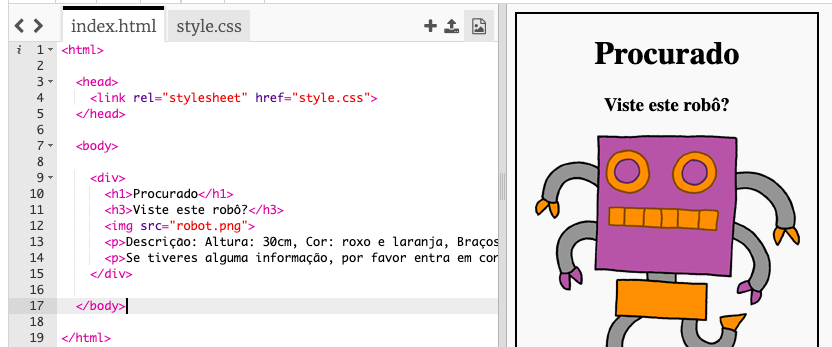
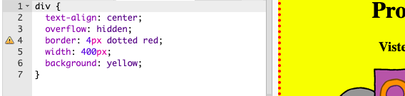

## Estilizar o teu cartaz

Vamos começar por editar o código CSS para o cartaz.

+ Abre este trinket: <a target="_blank" href="https://trinket.io/html/b87e66ed56">trinket.io/html/b87e66ed56</a>.
    
    O projeto deve-se parecer com isto:
    
    

+ Clica na aba "style.css". Vais notar que já existem propriedades CSS para `div` contendo as diferentes partes do cartaz.
    
        div {
            text-align: center;
            overflow: hidden;
            border: 2px solid black;
            width: 300px;
        }   
        

+ Vamos começar por alterar o alinhamento de texto com a propriedade `text-align`:
    
        text-align: center;
        
    
    O que acontece quando mudas a palavra `center` para `left` ou `right`?

+ E quanto á propiedade `border`?
    
        border: 2px solid black;
        
    
    `2px` no código acima significa 2 pixels. O que acontece quando mudas `2px sólido preto` para `4px dotted red`?

+ Altera a `largura` do cartaz para `400px`. O que acontece ao cartaz?

+ Vamos adicionar algum CSS para definir a cor de fundo do cartaz. Vai para o final da linha 5 do teu código e tecla 'enter', para que tenhas uma nova linha em branco.
    
    
    
    Digita o seguinte código na tua nova linha em branco:
    
        background: yellow;
        
    
    Certifica-te de que digitas o código *exatamente* como ele está acima. Deves notar que o fundo do `
` agora é amarelo.
    
    