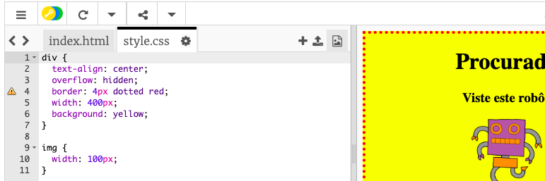

## Estilizar imagens

Vamos melhorar o estilo da imagem no cartaz.

+ De momento, não há nenhuma propriedade CSS para a tua tag ``, então vamos adicionar algumas!
    
    Primeiro, adiciona seguinte código abaixo do CSS para a tua div:
    
        img {
        
        }
        
    
    

+ Agora podemos adicionar propriedades CSS para imagens entre as chavetas.
    
    Por exemplo, adiciona este código entre as chavetas para definir a largura da imagem:
    
        width: 100px;
        
    
    Vais ver que o tamanho da imagem muda, e a sua largura fica 100 pixels.
    
    

+ Também podes adicionar uma borda ao redor da imagem com este código:
    
        border: 1px solid black;
        

+ Notaste que não há muito espaço entre a imagem e a borda?
    
    
    
    Podes corrigir isto adicionando um espaçamento em torno da imagem:
    
        padding: 10px;
        
    
    Padding (preenchimento) é o espaço entre o conteúdo (neste caso, uma imagem) e a borda.
    
    
    
    O que achas que aconteceria se alterasses o preenchimento (padding) para `50px`?