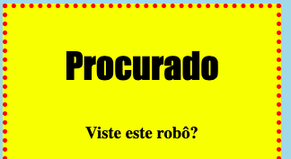
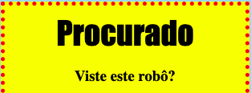

## Estilizar cabeçalhos

Vamos melhorar o estilo do cabeçalho `<h1>`.

+ Adiciona o seguinte código abaixo do CSS da tua imagem:
    
        h1 {
        
        }
        
    
    É aqui que vais adicionar propriedades CSS para o teu cabeçalho principal `<h1>`.

+ Para alterar a fonte dos teus cabeçalhos `<h1>` adiciona o seguinte código entre as chavetas:
    
        font-family: Impact;
        

+ Também podes alterar o tamanho do título:
    
        font-size: 50pt;
        

+ Reparaste que há um grande espaço entre o cabeçalho `<h1>` e as coisas à sua volta?
    
    
    
    Isso é porque há uma margem em torno do cabeçalho. Uma margem é o espaço entre o elemento (neste caso, um cabeçalho) e as outras coisas ao seu redor.
    
    Podes diminuir a margem com este código:
    
        margin: 10px;
        
    
    

+ Também podes sublinhar o teu cabeçalho:
    
        text-decoration: underline;