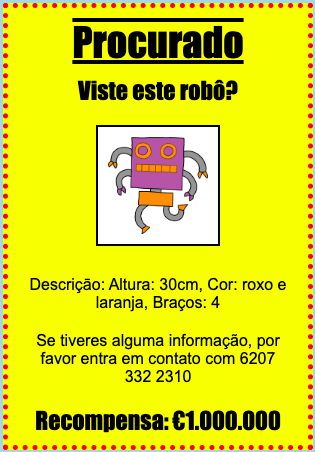

\--- challenge \---

## Desafio: Torna o teu poster fantástico!

Adiciona mais código CSS para estilizar os teus cabeçalhos `<h3>` e os teus parágrafos.

Aqui está uma lista de algumas propriedades CSS que podes usar:

    color: black;
    background: white;
    font-family: Arial / Comic Sans MS / Courier / Impact / Tahoma;
    font-size: 12pt;
    font-weight: bold;
    text-decoration: underline overline line-through;
    margin: 10px;
    padding: 10px;
    width: 100px;
    height: 100px;
    

\--- /challenge \---