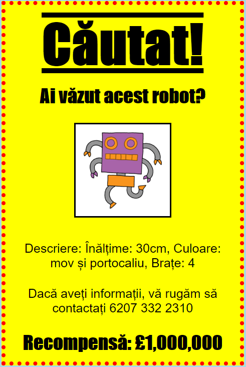

## Introducere

În acest proiect, vei învăța cum să-ți faci propriul un afiș.

### Informații suplimentare pentru educatori

Dacă vrei să printezi acest proiect, folosește [Versiunea printabilă](https://projects.raspberrypi.org/en/projects/wanted/print).

## \--- collapse \---

## title: Note pentru liderul de club

## Introducere:

În cadrul acestui proiect, copiii vor avea ocazia să își scrie propriul cod CSS. De asemenea, vor edita și scrie proprietăți CSS și selectori pentru a-și realiza propriul afiș.

## Resurse online

Recomandăm folosirea [trinket](https://trinket.io/) pentru a scrie HTML & CSS online. Proiectul conține următoarele trinket-uri:

* [Punctul de pornire pentru „Căutat” -- jumpto.cc/web-wanted](http://jumpto.cc/web-wanted)

Copiii pot, de asemenea, utiliza acest trinket gol [(jumpto.cc/html-blank)](http://jumpto.cc/html-blank) pentru a scrie propriul lor cod HTML & CSS, sau pot folosi acest șablon în trinket [(jumpto.cc/html-template)](http://jumpto.cc/html-template).

Există, de asemenea, un trinket care conține un exemplu de soluție pentru provocări:

* [„Căutat” completat -- trinket.io/html/ebeb56398a](https://trinket.io/html/ebeb56398a)

## Resurse offline

Dacă dorești, poți realiza [acest proiect](https://www.codeclubprojects.org/en-GB/resources/webdev-working-offline/) si offline. Se pot accesa resursele proiectului dând click pe link-ul „Materiale pentru proiect”. Acest link conține o secțiune „Resursele proiectului” ce include materialele de care copiii vor avea nevoie pentru realizarea proiectului offline. Asigură-te că fiecare copil are acces la resurse. Secțiunea include următoarele:

* template/index.html
* template/style.css
* wanted/index.html
* wanted/style.css
* wanted/robot.png

De asemenea, poți găsi o versiune finalizată a provocărilor din acest proiect în secțiunea „Resurse pentru liderul de club”, care conține:

* wanted-finished/index.html
* wanted-finished/style.css
* wanted-finished/robot.png

(Toate resursele de mai sus se pot descărca ca fișiere `.zip` pentru proiect și pentru liderii de club.)

## Obiective de învățare

* Acest proiect oferă copiilor posibilitatea de a-și scrie propriul cod CSS pentru a crea o pagină web.

Acest proiect acoperă elemente din următoarele domenii ale [Raspberry Pi Digital Making Curriculum](http://rpf.io/curriculum):

* [Proiectarea elementelor grafice 2D și 3D de bază](https://www.raspberrypi.org/curriculum/design/creator).

## Provocări

* „Îmbunătățirea afișului tău” - adăugarea de noi proprietăți CSS la selectorul `div`;
* „Îmbunătățirea imaginii tale” - adăugarea de noi proprietăți CSS la selectorul `img`;
* „Fă-ți afișul și mai grozav” - adăugarea de noi proprietăți CSS și noi titluri `h3` și selectoare de paragrafe `p`;
* „Anunță un eveniment” - Scrierea și editarea de cod HTML și CSS.

\--- /collapse \---

## \--- collapse \---

## title: Materiale pentru proiect

## Resursele proiectului

* [fișier .zip care conține toate resursele proiectului](resources/wanted-project-resources.zip)
* [Trinket online care conține toate resursele proiectului „Căutat!”](http://jumpto.cc/web-wanted)
* [Șablon Trinket online](http://jumpto.cc/trinket-template)
* [Trinket online gol](http://jumpto.cc/trinket-blank)
* [template/index.html](resources/template-index.html)
* [template/style.css](resources/template-style.css)
* [wanted/index.html](resources/wanted-index.html)
* [wanted/style.css](resources/wanted-style.css)
* [wanted/robot.png](resources/wanted-robot.png)

## Resursele liderului de club

* [fișier .zip care conține toate resursele proiectului, completate](resources/wanted-volunteer-resources.zip)
* [Proiect Trinket online, completat](https://trinket.io/html/ebeb56398a)
* [wanted-finished/index.html](resources/wanted-finished-index.html)
* [wanted-finished/style.css](resources/wanted-finished-style.css)
* [twanted-finished/robot.png](resources/twanted-finished-robot.png)

\--- /collapse \---