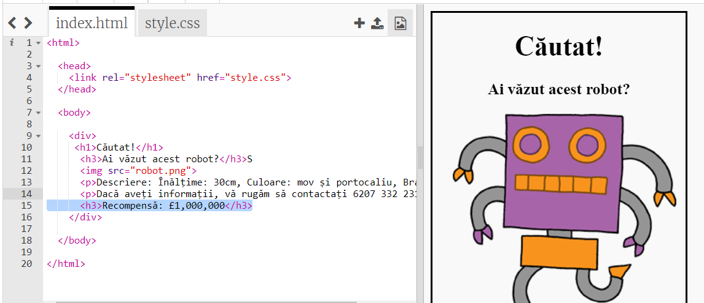
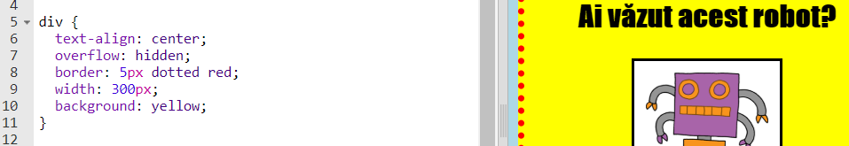

## Stilizarea afișului

Să începem prin editarea codului CSS pentru afiș.

+ Deschide acest trinket: <a target="_blank" href="http://jumpto.cc/web-wanted">jumpto.cc/web-wanted</a>.
    
    Proiectul ar trebui să arate astfel:
    
    

+ Dă click pe tab-ul „style.css”. Vei observa că există deja proprietăți CSS pentru selectorul ` div ` care conține diferite părți din afiș.
    
        div {
            text-align: center;
            overflow: hidden;
            border: 2px solid black;
            width: 300px;
        }   
        

+ Să începem modificând `text-align` (proprietatea de aliniere a textului):
    
        text-align: center;
        
    
    Ce se întâmplă când schimbi cuvântul `center` cu ` left ` sau ` right `?

+ Să observăm si proprietatea `border`
    
        border: 2px solid black;
        
    
    ` 2px ` în codul de mai sus înseamnă 2 pixeli. Ce se întâmplă când schimbi `2px solid black` cu `4px dotted red`?

+ Modifică lățimea ` ` afișului la ` 400px `. Ce se întâmplă cu afișul?

+ Să adăugăm câteva elemente CSS pentru a seta culoarea de fundal a afișului. Du-te la sfârșitul liniei 5 a codului tău și apăsă Enter, astfel încât vei avea o nouă linie goală.
    
    
    
    Scrie următorul cod pe linia goala:
    
        background: yellow;
        
    
    Verifică că ai scris *exact* ca mai sus. Acum, ar trebui ca fundalul afișului tău să fie galben.
    
    