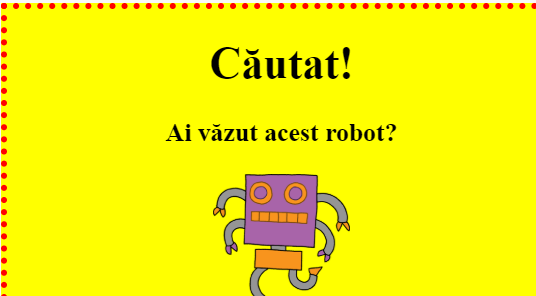

## Stilizarea imaginilor

Să îmbunătățim imaginea din afiș.

+ Momentan, nu există proprietăți CSS pentru eticheta ``, așa că hai să adăugăm noi unele!
    
    În primul rând, adăugă sub CSS următoarele rânduri de cod pentru div-ul tău:
    
        img {
        
        }
        
    
    

+ Acum putem adăuga între acolade proprietăți CSS pentru imagini.
    
    Poți adăuga, de exemplu, următorul cod pentru a stabili lățimea imaginii:
    
        width: 100px;
        
    
    Vei observa că imaginea a fost redimensionată astfel încât acum va avea 100px lățime.
    
    

+ Poți adăuga, de asemenea, un chenar în jurul imaginii astfel:
    
        border: 1px solid black;
        

+ Ai observat că nu există prea mult spațiu între imagine și chenar?
    
    
    
    Poți repara asta adăugând o distanță în jurul imaginii:
    
        padding: 10px;
        
    
    Padding este spațiul dintre conținut (în acest caz o imagine) și chenarul acestuia.
    
    
    
    Ce crezi că s-ar întâmpla dacă ai schimba padding-ul la `50px`?