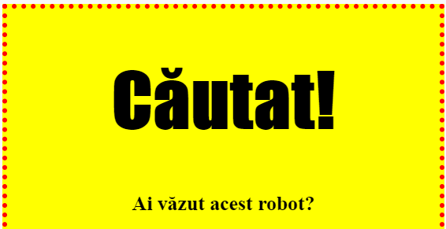
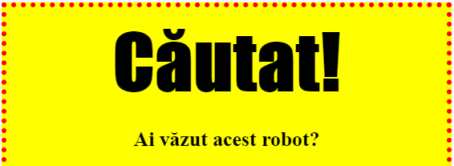

## Stilizarea titlurilor

Să imbunătățim stilul pentru titlul `<h1>`.

+ Adaugă următorul cod sub CSS-ul imaginii tale:
    
        h1 {
        
        }
        
    
    Aici vei adăuga proprietăți CSS pentru titlul `<h1>`.

+ Pentru a schimba fontul titlului `<h1>`, adăugă următorul cod între acolade:
    
        font-family: Impact;
        

+ Poți să schimbi, de asemenea, si dimensiunea textului din titlu:
    
        font-size: 50pt;
        

+ Ai observat că există un spațiu mare între titlul `<h1>` și celelalte elemente de pe afiș?
    
    
    
    Acest lucru se datorează faptului că există o margine în jurul acestuia. O margine este spațiul dintre element (în acest caz titlul) și celelalte din jurul său.
    
    Poți reduce marginea astfel:
    
        margin: 10px;
        
    
    

+ De asemenea, poți și sublinia textul din titlu:
    
        text-decoration: underline;