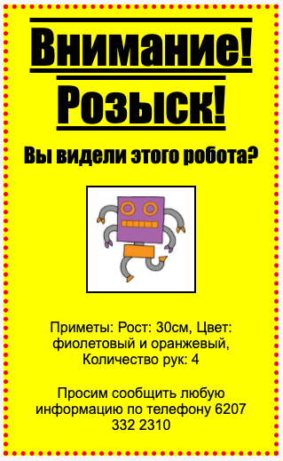

## Введение

В этом проекте ты узнаешь, как сделать свой собственный постер.

### Дополнительная информация для руководителя клуба

Если вам нужно распечатать этот проект, пожалуйста, используйте [Версию для печати](https://projects.raspberrypi.org/en/projects/wanted/print).

## \--- collapse \---

## title: Заметки для руководителя клуба

## Введение:

В этом проекте у детей будет возможность написать свой собственный CSS-код. Они будут создавать и редактировать свойства и селекторы каскадных таблиц стилей (CSS), чтобы сделать свой плакат.

## Интернет-ресурсы

Мы рекомендуем использовать [trinket](https://trinket.io/) для написания HTML и CSS кода онлайн. Этот проект содержит следующие trinket-ы:

* [Начальная версия проекта «Внимание! Розыск!» — jumpto.cc/web-wanted](http://jumpto.cc/web-wanted)

Дети также могут использовать этот пустой trinket[(jumpto.cc/html-blank)](http://jumpto.cc/html-blank), чтобы создать свой собственный HTML и CSS код или, в качестве альтернативы, они могут использовать этот шаблон [(jumpto.cc/html-template)](http://jumpto.cc/html-template).

Имеется также trinket, содержащий пример решения задач:

* [Завершённый проект «Внимание! Розыск!» — trinket.io/html/ebeb56398a](https://trinket.io/html/ebeb56398a)

## Оффлайн ресурсы

This project can be [completed offline](https://rpf.io/html-offline) if preferred. Вы можете получить доступ к ресурсам этого проекта, щёлкнув в нём ссылку «Материалы проекта». Эта ссылка содержит раздел "Ресурсы проекта", включающий ресурсы, которые понадобятся детям, чтобы завершить этот проект оффлайн. Пожалуйста, убедитесь, что у каждого ребёнка есть доступ к копии этих ресурсов. Этот раздел содержит следующие файлы:

* template/index.html
* template/style.css
* wanted/index.html
* wanted/style.css
* wanted/robot.png

Вы также можете найти завершённую версию задач из этого проекта в разделе «Ресурсы для лидеров клуба», который содержит:

* wanted-finished/index.html
* wanted-finished/style.css
* wanted-finished/robot.png

(Все вышеперечисленные ресурсы также можно загрузить как project и volunteer `.zip` файлы.)

## Цели обучения

* Этот проект даёт детям возможность написать свой собственный CSS-код для стилизации веб-страниц.

Этот проект охватывает элементы из следующих разделов [Raspberry Pi Digital Making Curriculum](http://rpf.io/curriculum):

* [Основы дизайна 2D и 3D элементов](https://www.raspberrypi.org/curriculum/design/creator).

## Задачи

* «Улучшение постера» — добавление новых CSS-свойств к селектору `div`;
* «Улучшение изображения» — добавление новых CSS-свойств к селектору `img`;
* «Сделай свой постер ещё более крутым!» — добавление новых CSS-свойств и новых селекторов `h3` и `p`;
* «Прорекламируй мероприятие!» — Написание и редактирование HTML и CSS кода.

\--- /collapse \---

## \--- collapse \---

## title: Материалы проекта

## Ресурсы проекта

* [.zip-файл, содержащий все ресурсы проекта](https://rpf.io/p/en/wanted-go)
* [Trinket, содержащий все ресурсы проекта «Внимание! Розыск!» (онлайн)](http://jumpto.cc/web-wanted)
* [Шаблон trinket-а (онлайн)](http://jumpto.cc/trinket-template)
* [Пустой trinket (онлайн)](http://jumpto.cc/trinket-blank)
* [template/index.html](resources/template-index.html)
* [template/style.css](resources/template-style.css)
* [wanted/index.html](resources/wanted-index.html)
* [wanted/style.css](resources/wanted-style.css)
* [wanted/robot.png](resources/wanted-robot.png)

## Ресурсы для руководителя клуба

* [.zip-файл, содержащий все ресурсы завершённого проекта](https://rpf.io/p/en/wanted-go)
* [Завершённый проект в trinket (онлайн)](https://trinket.io/html/ebeb56398a)
* [wanted-finished/index.html](resources/wanted-finished-index.html)
* [wanted-finished/style.css](resources/wanted-finished-style.css)
* [wanted-finished/robot.png](resources/twanted-finished-robot.png)

\--- /collapse \---