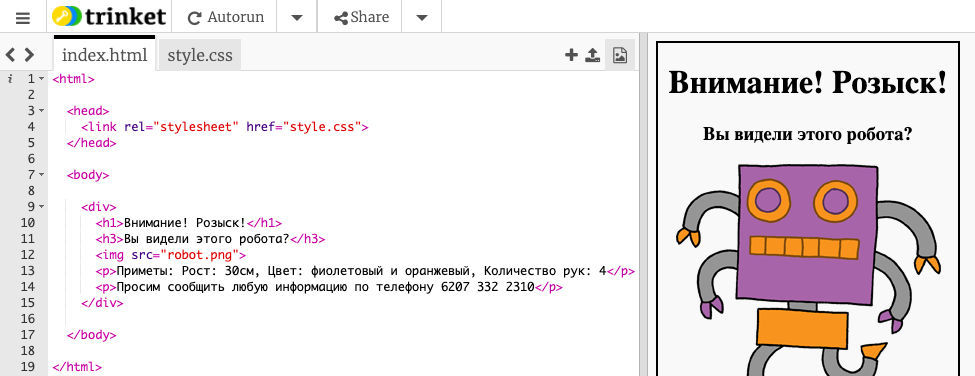
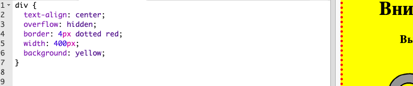

## Стилизация твоего плаката

Давай начнём с редактирования кода CSS для плаката.

+ Открой этот trinket: <a target="_blank" href="http://jumpto.cc/web-wanted">jumpto.cc/web-wanted</a>.
    
    Проект должен выглядеть следующим образом:
    
    

+ Нажми на вкладку «style.css». Ты заметишь, что CSS свойства уже прописаны для элемента `div`, содержащего различные части плаката.
    
        div {
            text-align: center;
            overflow: hidden;
            border: 2px solid black;
            width: 300px;
        }   
        

+ Давай начнём с изменения свойства `text-align`:
    
        text-align: center;
        
    
    Что произойдёт, если поменять слово `center` на `left` или `right`?

+ Как насчёт свойства `border`?
    
        border: 2px solid black;
        
    
    `2px` в коде выше означает 2 пикселя. Что произойдёт при замене `2px solid black` на `4px dotted red`?

+ Измени слово `width` (ширина на англ.) на `400px`. Что произойдёт с плакатом?

+ Давай добавим немного CSS, чтобы изменить цвет фона для плаката. Перейди к концу строки 5 в твоём коде и нажми клавишу «Ввод» (Enter) для создания новой пустой строки.
    
    
    
    Введи следующий код в новой пустой строке:
    
        background: yellow;
        
    
    Убедись, что ты ввёл код *в точности* так, как он представлен выше. Ты заметишь, что фон элемента `
` теперь жёлтый.
    
    