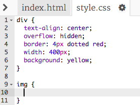
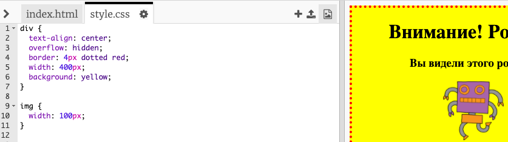

## Стилизация изображений

Давай улучшим стиль изображения на постере.

+ В данный момент, тэг `` не имеет никаких CSS-свойств. Давай же добавим их, и посмотрим что получится!
    
    Во-первых, добавь следующий код под CSS-кодом для div:
    ```
        img {
        
        }
    ```    
    
    

+ Теперь мы можем добавлят CSS-свойства для всех изображений. Ети свойства мы должни поместить между фигурными скобками.
    
    Например, добавь такой код, чтобы задать ширину изображения:
    ```
        width: 100px;
    ```    
    
    Ты увидишь, что размер изображения изменится до ширины в 100 пикселей.
    
    

+ Теперь ты можешь добавить рамку (границу) вокруг изображения с помощью такого кода:
    ```
        border: 1px solid black;
    ```    

+ Между изображением и его рамкой не так много пространства, не так ли?
    
    
    
    Давай исправим это, добавив свойство padding:
    ```
        padding: 10px;
    ```    
    
    Свойство padding задаёт размер полей (отступ) между содержимым (в данном случае это изображение) и рамкой.
    
    
    
    Как ти думаешь - что произойден, если поменять значение padding на `50px`?