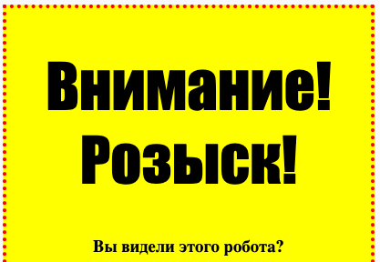
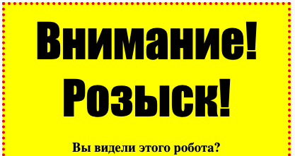

## Стилизация заголовков

Давай улучшим стиль заголовка `<h1>`.

+ Добавь следующий код под CSS-кодом для твоего изображения:
    ```
        h1 {
        
        }
    ```    
    
    В этом блоке, между фигурными скобками, нужно будеть добавить CSS-свойства для твоего главного заголовка `<h1>`.

+ Для смены шрифта всех твоих заголовков `<h1>` добавь следующий код:
    ```
        font-family: Impact;
    ```    

+ Ты также можешь изменить размер заголовка:
    ```
        font-size: 50pt;
    ```    

+ Заметил ли ты, что вокруг заголовка `<h1>` много пустого пространства?
    
    
    
    Это из-за того, что вокруг заголовка есть пустые поля. Margin (поле на англ.) — это пространство между элементом (в данном случае это заголовок) и всем остальным вокруг него.
    
    Ты можешь уменьшить размер полей с помощью кода:
    ```
        margin: 10px;
    ```    
    
    

+ Ещё ты можешь добавить к заголовку подчёркивание:
    ```
        text-decoration: underline;
    ```