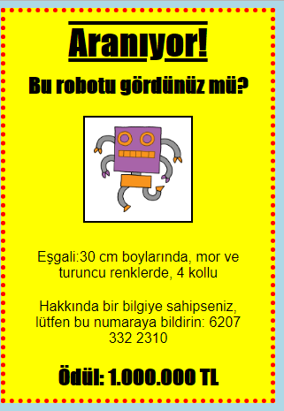

## Giriş

Bu projede, kendi posterinizi nasıl yapacağınızı öğreneceksiniz.

### Kulüp liderleri için ek bilgi

Bu projeyi yazdırmanız gerekiyorsa, lütfen [Yazıcı dostu sürüm](https://projects.raspberrypi.org/en/projects/wanted/print).

## \--- çöküş \---

## başlık: Kulüp lideri notları

## Giriş:

Bu projede çocuklar kendi CSS'lerini yazma fırsatına sahip olacaklar. Ayrıca, kendi posterlerini oluşturmak için CSS özelliklerini ve seçicilerini düzenleyip yazacaklar.

## Çevrimiçi kaynaklar

Çevrimiçi HTML & CSS yazmak için [biblo](https://trinket.io/) kullanmanızı öneririz. Bu proje aşağıdaki bibloları içeriyor:

* ['Aranıyor' başlangıç noktası - jumpto.cc/web-wanted](http://jumpto.cc/web-wanted)

Çocuklar da bu boş biblo yararlanabilirler [(jumpto.cc/html-blank)](http://jumpto.cc/html-blank) kendi HTML yazmak için & CSS ya da alternatif olarak bu şablon biblo kullanabilirsiniz [(jumpto.cc/html-template)](http://jumpto.cc/html-template).

Ayrıca zorluklara örnek bir çözüm içeren bir biblo da var:

* ['Aranıyor' Bitti - trinket.io/html/ebeb56398a](https://trinket.io/html/ebeb56398a)

## Çevrimdışı Kaynaklar

Bu proje, istenirse [çevrimdışı](https://www.codeclubprojects.org/en-GB/resources/webdev-working-offline/) tamamlanabilir. Proje kaynaklarına, bu proje için 'Proje Malzemeleri' bağlantısını tıklayarak erişebilirsiniz. Bu link, çocukların bu projeyi çevrimdışı tamamlamaları için ihtiyaç duyacağı kaynakları içeren bir 'Proje Kaynakları' bölümü içermektedir. Her çocuğun bu kaynakların bir kopyasına erişimi olduğundan emin olun. Bu bölüm aşağıdaki dosyaları içerir:

* Şablon / index.html
* Şablon / style.css
* aranan / index.html
* aranan / style.css
* aranan / robot.png

Bu projenin zorluklarının tamamlanmış bir versiyonunu da içeren 'Gönüllü Kaynaklar' bölümünde bulabilirsiniz:

* istediği mamul / index.html
* aranan mamul / style.css
* aranan mamul / robot.png

(Yukarıdaki kaynakların tümü proje olarak da indirilebilir ve gönüllü `.zip` dosyadır)

## Öğrenme hedefleri

* Bu proje, çocuklara bir web sayfasına stil vermek için kendi CSS'lerini yazma fırsatı veriyor.

Bu proje, [Raspberry Pi Dijital Hazırlama Müfredatı](http://rpf.io/curriculum)aşağıdaki bölümlerinden elemanları içermektedir:

* [Temel 2B ve 3B varlıkların tasarlanması](https://www.raspberrypi.org/curriculum/design/creator).

## Zorluklar

* "Posterinizi iyileştirme" - `div` seçiciye yeni CSS özellikleri ekleme;
* "Resminizi iyileştirme" - `img` seçiciye yeni CSS özellikleri ekleme;
* "Posterinizi harika yapın" - yeni CSS özellikleri ve yeni `h3` ve `p` seçicileri ekleyerek;
* "Bir etkinliğe reklam verin" - HTML ve CSS kodunu yazma ve düzenleme.

\--- /çöküş \---

## \--- çöküş \---

## başlık: Proje malzemeleri

## Proje kaynakları

* [tüm proje kaynaklarını içeren .zip dosyası](resources/wanted-project-resources.zip)
* [Tüm 'Wanted!' İçeren çevrimiçi biblo proje kaynakları](http://jumpto.cc/web-wanted)
* [Çevrimiçi Biblo şablonu](http://jumpto.cc/trinket-template)
* [Çevrimiçi boş biblo](http://jumpto.cc/trinket-blank)
* [Şablon / index.html](resources/template-index.html)
* [Şablon / style.css](resources/template-style.css)
* [aranan / index.html](resources/wanted-index.html)
* [aranan / style.css](resources/wanted-style.css)
* [aranan / robot.png](resources/wanted-robot.png)

## Kulüp lideri kaynakları

* [tamamlanan tüm proje kaynaklarını içeren .zip dosyası](resources/wanted-volunteer-resources.zip)
* [Online biblo projesi tamamlandı](https://trinket.io/html/ebeb56398a)
* [istediği mamul / index.html](resources/wanted-finished-index.html)
* [aranan mamul / style.css](resources/wanted-finished-style.css)
* [twanted mamul / robot.png](resources/twanted-finished-robot.png)

\--- /çöküş \---