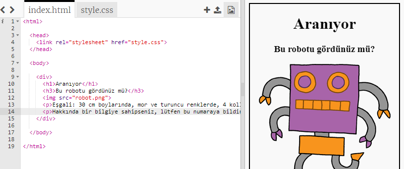
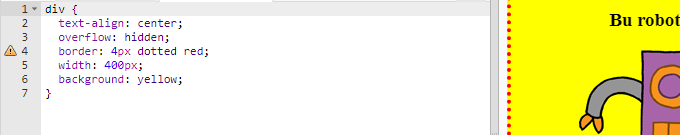

## Posterinizi şekillendirin

Posterin CSS kodunu düzenleyerek başlayalım.

+ Bu bibloyu aç: <a target="_blank" href="http://jumpto.cc/web-wanted">jumpto.cc/web-wanted</a>.
    
    Proje şöyle görünmeli:
    
    

+ "Style.css" sekmesine tıklayın. Posterin farklı bölümlerini içeren `div` için zaten CSS özelliklerinin olduğunu fark edeceksiniz.
    
        div {
            text-align: center;
            taşma: gizli;
            kenarlık: 2px katı siyah;
            genişlik: 300 piksel;
        }   
        

+ `text-align` özelliğini değiştirerek başlayalım:
    
        metin hizalama: orta;
        
    
    `merkez` - `sola` veya `sağa`kelimesini değiştirirseniz ne olur?

+ `kenarlık` özelliğine ne dersiniz?
    
        sınır: 2px katı siyah;
        
    
    `2px` yukarıdaki kodda 2 piksel anlamına gelir. `2px düz siyah` ila `4px noktalı kırmızı`değiştirirseniz ne olur?

+ Posterin `genişliğini` `400 piksel`. Postere ne olacak?

+ Posterin arka plan rengini ayarlamak için biraz CSS ekleyelim. Kodunuzun 5. satırının sonuna gidin ve return tuşuna basın, böylece yeni bir boş satırınız olur.
    
    
    
    Yeni boş satırınıza aşağıdaki kodu yazın:
    
        arkaplan: sarı;
        
    
    *kodunu tam olarak yukarıdaki gibi* yazdığınızdan emin olun. `
` arka planının artık sarı olduğunu fark etmelisiniz.
    
    