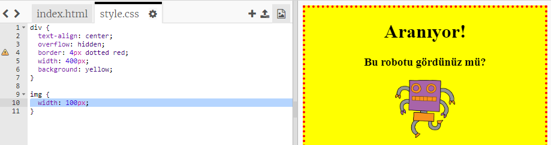

## Görüntüleri şekillendirme

Posterdeki görüntünün tarzını geliştirelim.

+ Şu anda `` etiketiniz için herhangi bir CSS özelliği yok, o yüzden biraz ekleyelim!
    
    Öncelikle, div'iniz için CSS'in altına aşağıdaki kodu ekleyin:
    
        img {
        
        }
        
    
    

+ Şimdi kıvrımlı parantezin içine resmin CSS özelliklerini ekleyebiliriz.
    
    Örneğin, görüntünün genişliğini ayarlamak için bu kodu kıvrımlı parantezlerin arasına ekleyin:
    
        width: 100px;
        
    
    Görüntünün boyutunun değiştiğini göreceksiniz, böylece genişliği 100 piksel olacaktır.
    
    

+ Bu kodla resmin etrafına kenarlık da ekleyebilirsiniz:
    
        border: 1px solid black;
        

+ Görüntü ve kenarlık arasında pek fazla boşluk olmadığını farkettiniz mi?
    
    
    
    Resmin çevresine biraz dolgu ekleyerek bunu düzeltebilirsiniz:
    
        padding: 10px;
        
    
    Dolgu, içerik (bu durumda bir resim) ile kenarlığı arasındaki boşluktur.
    
    
    
    Dolguyu `50px` ile değiştirirseniz ne olacağını düşünüyorsunuz?