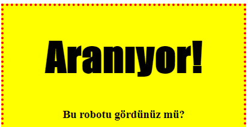
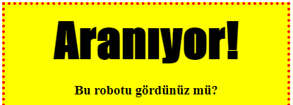

## Styling başlıkları

`<h1>` başlığının stilini geliştirelim.

+ Resminizin CSS'in altına aşağıdaki kodu ekleyin:
    
        h1 {
        
        }
        
    
    Burası ana `<h1>` başlığınız için CSS özelliklerini ekleyeceğiniz yerdir.

+ `<h1>` başlıklarınızın yazı tipini değiştirmek için, küme parantezleri arasına aşağıdaki kodu ekleyin:
    
        font-family: Etki;
        

+ Başlığın boyutunu da değiştirebilirsiniz:
    
        yazı tipi boyutu: 50pt;
        

+ `<h1>` etrafındakiler arasında büyük bir boşluk olduğunu fark ettin mi?
    
    
    
    Bunun nedeni, başlığın etrafında bir boşluk olması. Kenar boşluğu, eleman (bu durumda bir başlık) ile etrafındaki diğer şeyler arasındaki boşluktur.
    
    Marjı bu kodla daha küçük hale getirebilirsiniz:
    
        marj: 10 piksel;
        
    
    

+ Başlığınızın altını da çizebilirsiniz:
    
        metin dekorasyon: altı çizili;