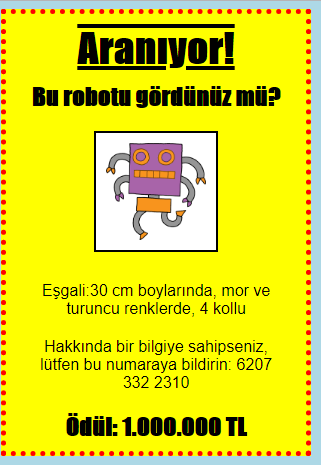

\--- meydan okuma \---

## Zorluk: Posterini mükemmelleştir!

`<h3>` başlıklarınıza ve paragraflarınıza stil vermek için daha fazla CSS kodu ekleyin.

İşte kullanabileceğiniz bazı CSS özelliklerinin bir listesi:

    siyah renk;
    arka plan: beyaz;
    font ailesi: Arial / Comic Sans MS / Kurye / Etki / Tahoma;
    yazı tipi boyutu: 12pt;
    yazı tipi ağırlığı: kalın;
    metin dekorasyon: alt çizgi çizgisinin altını çizin;
    marj: 10 piksel;
    dolgu: 10 piksel;
    genişlik: 100 piksel;
    yükseklik: 100 piksel;
    

\--- /meydan okuma \---