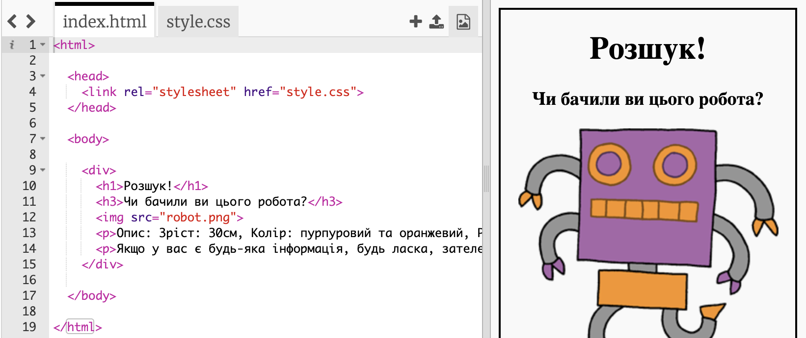

## Стилізуйте ваш плакат

Почнемо з редагування коду CSS для плаката.

+ Відкрийте цей trinket:<a target="_blank" href="http://jumpto.cc/web-wanted">jumpto.cc/web-letter</a>.
    
    Проект повинен виглядати так:
    
    

+ Клацніть на вкладці "style.css". Ви побачите, що для `div` існують вже властивості CSS </0>, що містять різні частини плаката.
    
        div {
            text-align: center;
            overflow: hidden;
            border: 2px solid black;
            width: 300px;
        }   
        

+ Давайте почнемо зі зміни властивості `text-align`:
    
        text-align: center;
        
    
    Щро трапиться, якш=що ви зміните слово `center` на `left` чи`right`?

+ А як щодо властивості `border`?
    
        border: 2px solid black;
        
    
    `2px` в коді вище означає 2 пікселі. Що трапиться, якщо ви змінете `2px solid black` на`4px dotted red`?

+ Змініть `width` плаката на `400px`. Що трапиться з плакатом?

+ Давайте додамо деякий CSS, щоб встановити фоновий колір плаката. Перейдіть до кінця рядка 5 вашого коду та натисніть повернутися, щоб у вас з'явився новий пустий рядок.
    
    
    
    Введіть наступний код на ваш новий пустий рядок:
    
        background: yellow;
        
    
    Переконайтеся, що ви вводите код *exactky* як це показано вище. Ви повинні зауважити, що фон `
` зараз жовтий.
    
    