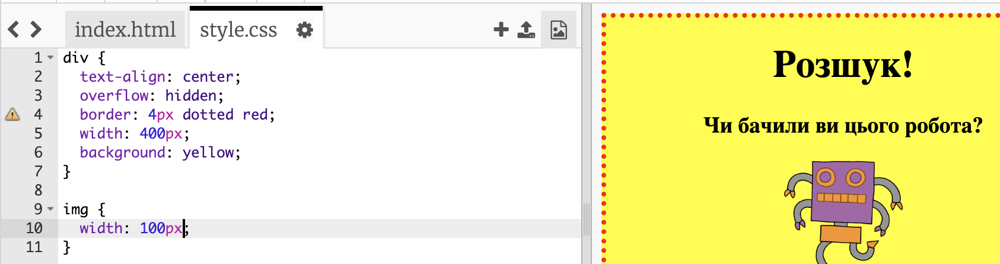

## Стилізуйте зображення

Давайте покращимо стиль зображення в плакаті.

+ Наразі для вашого тегу `` не існує жодних властивостей CSS, тому давайте додамо деякі!
    
    По-перше, додати наступний код, що є внизу CSS для вашого div:
    
        img {
        
        }
        
    
    

+ Тепер ви можете додати властивості CSS для зображень між ` ` фігурними дужками.
    
    Наприклад, додайте цей код між фігурними дужками, щоб встановити ширину зображення:
    
        width: 100px;
        
    
    Ви побачите, що розмір зображення змінюється так, що його ширина становить 100 пікселів.
    
    

+ Ви також можете додати межі навколо зображення за допомогою цього коду:
    
        border: 1px solid black;
        

+ Ви побачили, що між зображенням та межею нема багато місця?
    
    
    
    Ви можете виправити це, додавши деякі пробіли навколо зображення:
    
        padding: 10px;
        
    
    Відступ - це простір між вмістом (в даному випадку зображення) та його межами.
    
    
    
    Як ви думаєте, що станеться, якщо ви змінили простір `50px`?