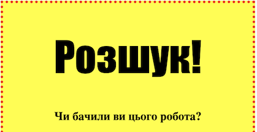
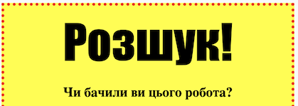

## Стилізуйте заголовки

Вдоскональте стиль заголовку `<h1>`.

+ Додайте наступний код внизу CSS вашого зображення:
    
        h1 {
        
        }
        
    
    Тут ви додасте властивості CSS для головного `<h1>` заголовка.

+ Щоб змінити шрифт `<h1>` заголовків, додайте наступний код між фігурними дужками:
    
        font-family: Impact;
        

+ Ви також можете змінити розмір заголовка:
    
        font-size: 50pt;
        

+ Ви помітили, що між заголовком `<h1>` і матеріалом навколо нього є великий простір?
    
    
    
    Це тому, що навколо заголовка є межі. Межа - це пробіл між елементом (у цьому випадку заголовок) та іншим матеріалом навколо нього.
    
    Ви можете зробити межу меншою за допомогою цього коду:
    
        margin: 10px;
        
    
    

+ Ви також можете підкреслити свій заголовок:
    
        text-decoration: underline;