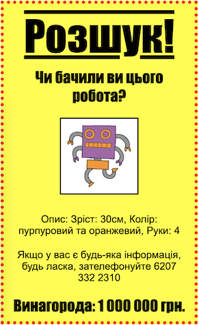

--- challenge ---

## Завдання: Зробіть ваш постер надзвичайним!

Додайте більше CSS-коду, щоб створити свої `<h3>` заголовки та абзаци.

Ось список деяких властивостей CSS, які ви можете використовувати:

    color: black;
    background: white;
    font-family: Arial / Comic Sans MS / Courier / Impact / Tahoma;
    font-size: 12pt;
    font-weight: bold;
    text-decoration: underline overline line-through;
    margin: 10px;
    padding: 10px;
    width: 100px;
    height: 100px;
    

--- /challenge ---