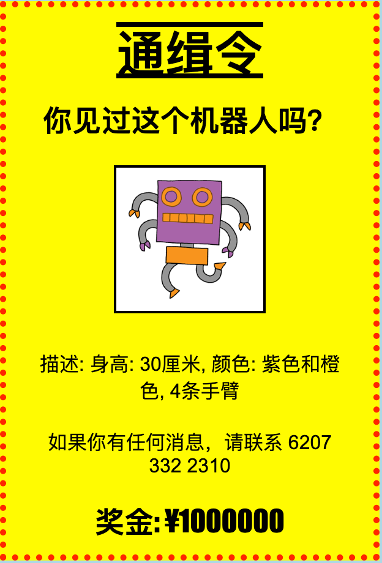

## 介绍

你将在本项目中学习如何制作你自己的海报。

### 更多俱乐部导师参考信息

如果你需要打印本项目，请使用 [适合打印机的版本](https://projects.raspberrypi.org/en/projects/wanted/print)。

## \--- collapse \---

## title: 俱乐部导师说明

## 介绍：

在这个项目中，孩子们将有机会自己编写CSS。他们还将编辑和设计CSS属性和选择器来制作自己的海报。

## 在线资源

我们推荐使用 [trinket](https://trinket.io/) 来在线编写 HTML & CSS。本项目包含以下 trinket：

* [“通缉令”起点 -- jumpto.cc/web-wanted](http://jumpto.cc/web-wanted)

孩子们也可以使用此空白trinket [(jumpto.cc/html-blank)](http://jumpto.cc/html-blank)来编写他们的 HTML & CSS， 或者使用trinket模板 [(jumpto.cc/html-template)](http://jumpto.cc/html-template)。

这里是一份该项目挑战的trinket示范解决方案：

* [“通缉令”已完成 -- trinket.io/html/ebeb56398a](https://trinket.io/html/ebeb56398a)

## 离线资源

This project can be [completed offline](https://rpf.io/html-offline) if preferred. 你可以点击本项目的“项目资料”链接访问项目资源。 这个链接包含一个 “项目资源” 部分，里面有孩子们完成该项目所需的离线资源。 请确保每个孩子都可以访问这些资源。 这部分包含如下文件：

* template/index.html
* template/style.css
* wanted/index.html
* wanted/style.css
* wanted/robot.png

You can also find a completed version of this project's challenges in the 'Club leader resources' section, which contains:

* wanted-finished/index.html
* wanted-finished/style.css
* wanted-finished/robot.png

(上述所有资源均可下载为项目和志愿者`.zip`文件。)

## 学习目标

* 本项目让孩子们有机会编写自己的 CSS 来设置网页样式。

本项目涵盖[树莓派数字制作课程](http://rpf.io/curriculum)如下几方面内容：

* [设计基本的 2D 和 3D 资源](https://www.raspberrypi.org/curriculum/design/creator) 。

## 挑战

* “完善你的海报”- 向 `div` 选择器添加新的 CSS 属性；
* “完善你的图片”- 向 `img` 选择器添加新的 CSS 属性；
* “使你的海报引人注目”- 添加新的 CSS 属性以及新的 `h3` 和 `p` 选择器；
* “宣传一场活动”- 编写并编辑 HTML 和 CSS 代码。

\--- /collapse \---

## \--- collapse \---

## title: 项目资源

## 项目资源

* [包含所有项目资源的.zip文件](https://rpf.io/p/en/wanted-go)
* [包含所有“通缉令”项目资源的在线 Trinket](http://jumpto.cc/web-wanted)
* [在线 Trinket 模板](http://jumpto.cc/trinket-template)
* [在线空白 Trinket 项目](http://jumpto.cc/trinket-blank)
* [template/index.html](resources/template-index.html)
* [template/style.css](resources/template-style.css)
* [wanted/index.html](resources/wanted-index.html)
* [wanted/style.css](resources/wanted-style.css)
* [wanted/robot.png](resources/wanted-robot.png)

## 俱乐部导师资源

* [包含所有完成项目资源的.zip文件](https://rpf.io/p/en/wanted-go)
* [在线已完成的Trinket项目](https://trinket.io/html/ebeb56398a)
* [wanted-finished/index.html](resources/wanted-finished-index.html)
* [wanted-finished/style.css](resources/wanted-finished-style.css)
* [twanted-finished/robot.png](resources/twanted-finished-robot.png)

\--- /collapse \---